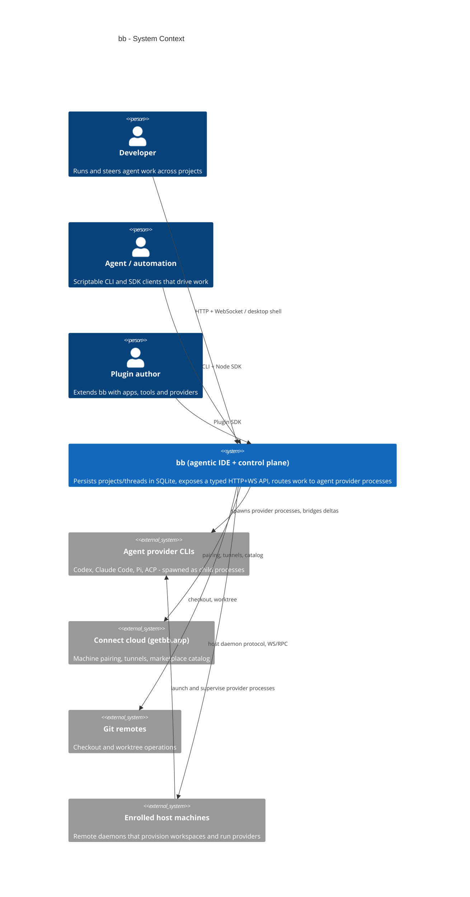

# bb — Agentic IDE and Agent Control Plane

bb is an open-source (MIT) agentic IDE that treats AI coding agents as first-class, steerable units of work. Rather than being a thin chat wrapper over a single model, bb launches real coding-agent *provider processes* — Codex, Claude Code, Pi, and ACP — on the machine where the work should run, bridges their output into one typed event stream, and persists everything in a local SQLite database. A **thread** is the unit of work: it carries a conversation, a lifecycle state, an environment (a directory on disk), and a provider. You can start work on your phone, follow it live on the web app, approve a permission prompt in the desktop app, or hand the thread off to a different agent mid-flight — every surface drives the same engine.

This checkout is "The Arc", Adnan's personal distribution: the full bb source plus a customization layer in `adnan/` (plugins, theme, one-command installers). The documentation set that follows (Overview, Architecture, Workflows, Deep-Exploration, Boundaries & Interfaces, Database) maps the whole monorepo so a new reader can trace any feature from UI to database row.

## What It Does

bb's core promise is "an agentic IDE that builds itself". Concretely, that means three capabilities that most agent front-ends lack.

**Live, steerable threads.** A thread is not a one-shot chat. It streams provider output as a typed event log, renders a hierarchical timeline (conversation rows, work rows, turn rows), and can be steered mid-turn: send another message, retry, stop, fork, pin, archive, or hand the thread to a different provider while its conversation history is preserved (`apps/server/src/services/threads/`).

**A control plane across machines.** The server stores all state and owns product policy; *enrolled host daemons* on other machines execute work. The server routes typed commands to a daemon over an authenticated WebSocket (`HOST_DAEMON_PROTOCOL_VERSION = 215` in `packages/host-daemon-contract/src/protocol.ts`), the daemon provisions a workspace, launches a provider process, and streams raw host-local events back. The server and daemon boundary is deliberately strict: the server never provisions workspaces, and the daemon never decides product policy.

**An extension platform.** Plugins are first-class citizens with their own SDK, build pipeline, marketplace, and provenance rules. A plugin can add app UI slots, server RPCs, background cron services, agent tools, CLI subcommands — even entire *environment providers* and *machine providers* that change where and how work runs. The plugin API is contract-typed (`BbPluginApi` in `packages/plugin-sdk/src/backend-contract.ts`), so the SDK types and the server implementation cannot drift apart.

## C4 Context Diagram (System Panorama)

The diagram below shows bb at the center of its ecosystem: four user surfaces on the left, the provider world and remote execution on the right, and the cloud services that enable remote pairing.

Read from this diagram: bb is not itself an LLM provider — it deliberately delegates intelligence to provider CLIs that the user already has authenticated. Its leverage comes from *orchestration*: a single typed state model plus multiple execution surfaces. The cloud service is an enabler for remote/mobile use, not a hard dependency; a purely local setup talks to providers and hosts directly over loopback.

## Thinking Behind the Tech Stack

Every technology choice in this repo is in service of one design constraint: **the server must be able to reason about agent work without knowing anything about the machines it runs on**.

| Domain | Choice | Why |
|--------|--------|-----|
| Language & runtime | TypeScript, Node >= 22, ESM | A single language across server, UI, CLI, SDK and plugins keeps the typed contracts trivially shareable |
| Monorepo | pnpm workspaces + Turborepo | 20+ deployable apps/packages with strict dependency direction (apps → packages) and a Turbo task graph (`turbo.json`) |
| Server | Node.js + Hono, typed routes (`typedRoutes<PublicApiSchema>`) | Route schemas live in `@bb/server-contract` and are shared with clients, so an API contract change fails a typecheck before it ever ships |
| State | SQLite via Drizzle ORM, 128 committed SQL migrations | Zero-config local persistence; the DB is the single source of truth and the server is mostly stateless over it |
| Execution | Provider bridges + agent runtime (`packages/agent-runtime`) | bb launches real provider CLIs and negotiates a capability/grammar handshake, rather than talking to vendor HTTP APIs directly |
| Realtime | Custom WebSocket hub + long-poll fallback (`apps/server/src/ws/hub.ts`) | Coalesced `events-appended` fanout plus per-request waiters keep timeline updates cheap even for many clients |
| UI | React 19 + Vite, TanStack Query cache-owners | The client is a *projection* of server state: queries own cache slices and realtime only invalidates/patch them |
| Plugins | Custom SDK + esbuild-based `plugin-build` | Plugins ship as bundled `app.js`/`server.js`/`host.js` artifacts with per-plugin databases and provenance hashing |
| Packaging | `bb-app` npm package + Electron desktop shell | `npx bb-app@latest` self-builds and supervises server + host-daemon processes |

## What bb Can and Cannot Do

Settings expectations up front matters more than listing features.

**It can do:**
- Run and steer coding-agent work in persistent, forkable threads from any surface, including handing a thread between different agent providers.
- Distribute work across machines by enrolling host daemons, with workspace provisioning, terminal sessions, file operations, and git worktrees executed on the enrolled host.
- Persist a complete, typed, append-only event log per thread and re-produce a rich timeline from it on demand — the conversation model is event-sourced.
- Extend itself via a typed plugin SDK across app, server, and host surfaces, with a curated marketplace.
- Script every operation programmatically via the `bb` CLI or the Node SDK, in JSON-able output formats.

**It deliberately does not do:**
- Own the models. bb defers to provider CLIs (Codex, Claude Code, Pi, ACP) for actual agent reasoning; capabilities like model catalogs are surfaced from the providers themselves.
- Decide policy on the host. The daemon returns raw host data; all defaults, tool lists, instruction modes, and permission policy live on the server — a hard trust boundary that keeps enrolled machines simple and auditable.
- Fight the OS. Windows is supported only through WSL2, there is no tray icon, and native folder pickers are routed through server dialogs.
- Ship as an always-cloud product. Everything runs locally by default; the connect cloud is an optional pairing/tunnel layer.

## Where to Go Next

- **Architecture** (`2.Architecture.md`) — the container view, module responsibilities, and the key design decisions that shaped the monorepo.
- **Workflows** (`3.Workflows.md`) — end-to-end flows: sending a message, provisioning an environment, booting a plugin, routing a command to a host.
- **Deep Exploration** (`4.Deep-Exploration/`) — one document per domain module with concrete file references and internal data flows.
- **Boundaries & Interfaces** (`5.Boundaries-Interfaces.md`) — the full CLI surface, SDK areas, config/env variables, and the WebSocket protocol.
- **Database Overview** (`6.Database-Overview.md`) — the SQLite schema: tables, relationships, and the event log that powers thread state.