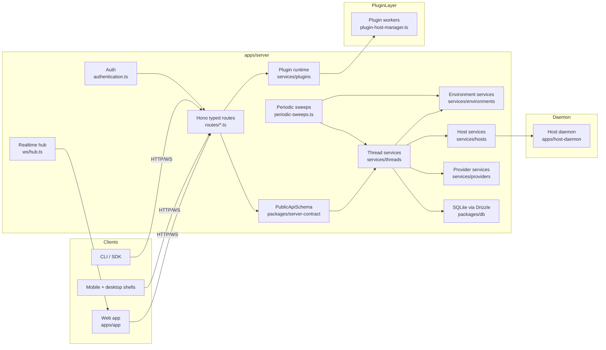
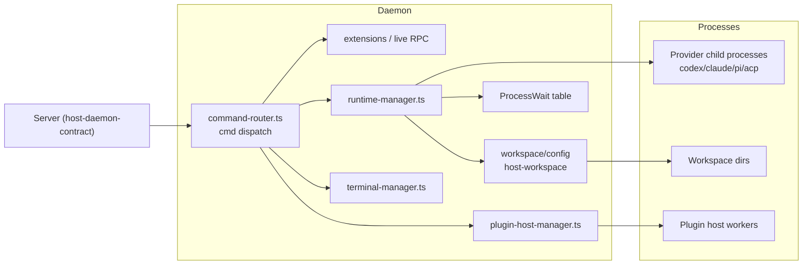

---

## 4. Component View (C4 Level 3) — The Server

The server is the composition root: every surface and every plugin converges there, and SQLite is its single source of truth. Its internals are shown below with the primary source anchors.



The **route layer** is a thin adapter: it validates requests against `PublicApiSchema`, extracts the authenticated actor, and delegates to services. The **service layers** hold the actual product logic and own the DB. The **realtime hub** and **periodic sweeps** are cross-cutting: the hub fans out `events-appended` notifications and RPC requests; the sweeps are the crash-recovery net that pushes queued work forward.

Component responsibilities, in one pass:

- **Thread send path** — `sendThreadMessage` (`apps/server/src/services/threads/thread-send.ts:459`) validates the message, resolves the execution plan and environment, and either dispatches immediately or enqueues a claim. `runDispatchAttempt` (`apps/server/src/services/threads/dispatch-attempt.ts:290`) drives the actual turn by issuing a `thread.start` daemon command.
- **Host/daemon RPC** — the server never sends async fire-and-forget commands; every command is issued and settled. `callHostOnlineRpc` (`apps/server/src/services/hosts/online-rpc.ts:66`) finds the right daemon connection, allocates a request id, and awaits the daemon's typed result — converting checkpoints/terminal snapshots into server-side state.
- **Realtime hub** — `NotificationHub` (`apps/server/src/ws/hub.ts:422`) keeps per-session subscriptions; events are coalesced so that a burst of writes becomes one push with `coalesceNotificationHubs` running on a 10 ms tick.
- **Plugin runtime** — `plugin-runtime.ts` loads a plugin's bundled `server.js` into a dedicated Node worker, exposes `app.slots.server.*` entry points, and adds the plugin's DDL to a namespaced per-plugin SQLite database (`services/plugins/plugin-db.ts:291`).

### 4.1 The Host Daemon Component

The daemon's architecture mirrors the server's split: a **command router** (thin, typed) and a **runtime manager** (thick, real work). Its C4 component internals:



The runtime manager (**`apps/host-daemon/src/runtime-manager.ts`**) is the daemon's heart: it owns provider processes, tracks process wait states, manages turn state machines, and streams raw host-local events back over the bridge. The command router (**`apps/host-daemon/src/command-router.ts`**) validates incoming commands from the server against a zod schema, checks permission ceilings, and settles them. The terminal manager runs interactive sessions; the plugin host manager boots per-plugin workers.

---

## 5. Key Flows (Architecture-Level)

Architecture is best understood by tracing one change end to end. Picking a single illustrative flow — the **thread send** — ties every layer together; four more flows are documented in `3.Workflows.md`.

### 5.1 Sending a Message to a Running Thread

```mermaid
sequenceDiagram
    participant U as User (web app)
    participant S as Server
    participant P as Plugin (auth)
    participant R as Agent runtime (on daemon)
    participant B as Provider process

    U->>S: POST /api/v1/threads/:id/messages (sendThreadMessage)
    S->>S: resolve execution plan (provider, worktree, env)
    S->>S: reserve manager-worker lifecycle
    opt queue, not running
        S->>S: upsert queuedThreadMessages claim
        S-->>U: accepted; turn not started yet
    end
    S->>R: thread.start (host RPC, expectedTurnId)
    R->>B: provider-specific bootstrap (bridge handshake)
    R-->>S: events stream: turn/*, status, deltas
    S->>S: persist events to SQLite, notify hub
    S-->>U: WS: events-appended (coalesced)
    U->>S: POST .../send (steer), GET timeline when needed
    S->>R: turn.submit(turnId) to continue
    R-->>B: inject next message
```

The thread-send flow demonstrates the layered discipline: the **server** decides *who* runs and with *what policy*, the **daemon** executes the turn state machine, and the **bridge** does dialect-specific translation. Every command carries an `expectedTurnId`, and the daemon echoes the new turn id back on every settlement, so a mid-turn steer cannot be lost in a race.

### 5.2 How the Design Would Cope With a New Agent Provider

The provider/bridge boundary is where new capability actually lands. Adding a new provider (say, "Trailblazer CLI") is:

1. Implement a `provider-bridge-*` bridge that speaks the bridge protocol, with capability negotiation in `packages/provider-bridge-protocol`.
2. Register the provider CLI name + executable under `apps/server/src/services/providers/provider-clis.ts`.
3. (Plugin authors: no server change needed — `defineProvider` in the Plugin SDK exposes the same seam as `tools/define-provider.ts`.)

The server's `ProviderRegistryService` then finds the new provider; model catalogs declared by the provider flow into the thread scheduler. This is the plugin-friendly face of the same boundary the host daemon protocol enforces: capabilities are described by the *executor*, never assumed by the caller.

---

## 6. Technical Implementation

### 6.1 Concurrency and State Safety

bb is a single-process Node server over a single-writer SQLite file, so concurrency is about *ordering and claims*, not distributed consensus. The rules:

- **All state mutations funnel through Drizzle transactions** (`packages/db`), with `better-sqlite3`'s synchronous API making transaction boundaries obvious.
- **Queue claims are compare-and-swap**: `queuedThreadMessages` are deleted only by the transaction that apps them; a crashed dispatch leaves the row for the next sweep (`dispatch-attempt.ts`).
- **Periodic sweeps carry an in-flight lock** (`periodic-sweeps.ts`), so overlapping sweep jobs cannot double-claim the same work.
- **The event log is append-only**; there is no "update this event" path in the hot loop. Rewinds write a new event fan-out.

### 6.2 The WebSocket Protocol in One Slide

Two protocols share the WebSocket surface: **client protocol** (`client-protocol.ts`, the web app) and **daemon protocol** (`daemon-protocol.ts`, enrolled machines). Both are JSON-RPC-ish request/response with a `requestId`, plus one-way server-push channels. Key messages: `wsReady` sez auth, `events-appended` publishes event-sourced deltas, `resolveAction`/`steer`/`terminate` for interactive threads, and `daemonCommand` / `daemonEvent` for host control. Versioning is explicit: `HOST_DAEMON_PROTOCOL_VERSION = 215` gates feature negotiation.

### 6.3 Performance Notes

| Concern | Approach | Why it holds |
|---------|----------|--------------|
| Timeline rebuild on large threads | `packages/thread-view` indexes by `sequenceIndex`; `buildThreadTimelineFromEvents` iterates only the event window a client requests | No unbounded materialization; DB is the archive, timeline is a page |
| Realtime fanout cost | Coalesced `events-appended` (10 ms bucket), per-session subscriptions | One write → one push even under bursty daemon telemetry |
| Queue backpressure | Lazy worktree creation; thread/queue reservations are DB-sparse | Uploaded download blobs are kept out of the hot path |
| SQLite single-writer | Drizzle transactions; no process needs read-your-writes across processes | Zero coordination overhead for local state |

### 6.4 Known Weaknesses and Migration Zigzags

Where the code is not single-writer-ideal, it is honest about it:

- **`bb` threads were originally "chat-shaped"** — early `threads` tables held a single `metadata` blob; today threads are a headless `thread` row + typed `events`. Legacy rows migrate forward in `packages/db/migrations/*.sql`, never rewritten in place.
- **`Cmd` naming drift**: the codebase grew `ThreadEvent`, `ClientMessage`, and `BridgeEvent` before settling on one `Cmd` dialect clock. The `Cmd` primitive now carries `sessionId` on both sides; `apps/server/src/ws/` and `apps/host-daemon/src/` both reference it.
- **One `extractor` service name survived from the old "workspace is a container" era** — harmless, but a reader should not look for containerization behind it.

---

## 7. Architectural Decision Records (Selected)

Architecture decisions are scattered through `apps/server/src/setup/config.ts` and `services/**`. The reasoned ones below are documented here so the "why not just X" questions have answers.

| ADR | Decision | Rationale / Trade-off |
|-----|----------|------------------------|
| **ADR-1: SQLite local-only** | Everything persists in `bb.db`; no external Postgres | Local-first UX; backups are file copy; the cloud presence is only connect pairing/tunnels. Trade-off: single-writer, no horizontal scale — acceptable for an agent's own state |
| **ADR-2: Provider process, not vendor API** | bb launches Codex/Claude/Pi as child processes behind a bridge | Trusts the user's existing auth; capability offers are negotiated live; works offline. Trade-off: version skew per provider CLI; handled by `provider-clis.ts` registry |
| **ADR-3: Two WebSocket surfaces** | `client-protocol.ts` (UI) and `daemon-protocol.ts` (hosts) are separate | UI and daemon have different trust/hop counts; splitting keeps the mutating host surface explicitly narrower |
| **ADR-4: Plugin workers are separate Node processes** | `plugin-host-manager.ts` runs each plugin in its own worker | Crash isolation and resource limits; stein leftovers, sandbox is process-level, not syscall-level |
| **ADR-5: No middleware platform** | Permission/instruction policy is server-owned, not a middleware chain | Keep daemon dumb and auditable; policy lives where the product owner can test it |
| **ADR-6: Bump `HOST_DAEMON_PROTOCOL_VERSION` with wire changes** | Enforced in `AGENTS.md` | Clients and daemons upgrade independently; the version gates feature bits so an old daemon can't misinterpret a new payload |

Each ADR is traceable to a source anchor in `3.Workflows.md` and the module docs under `4.Deep-Exploration/`; ADR-1 maps to `packages/db`, ADR-2/6 map to `packages/host-daemon-contract` and `apps/host-daemon`.