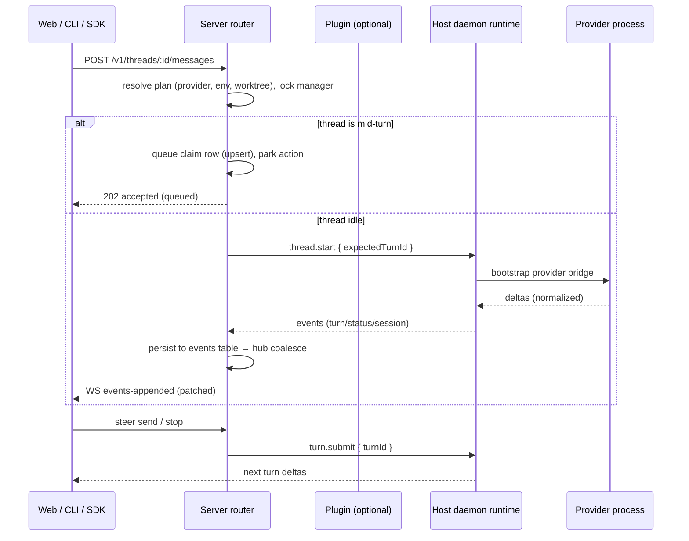
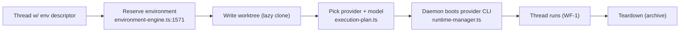
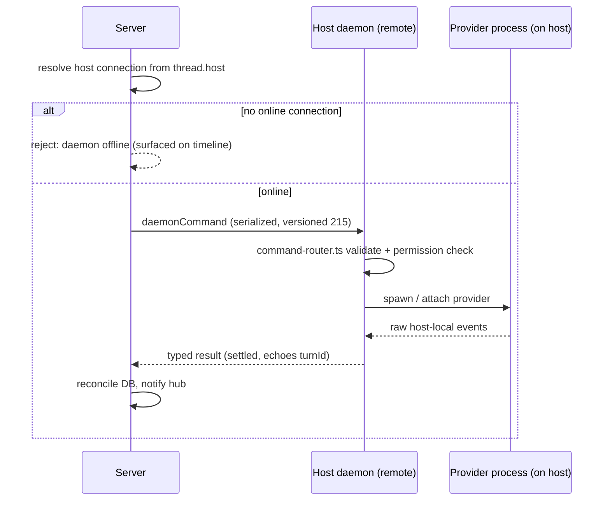
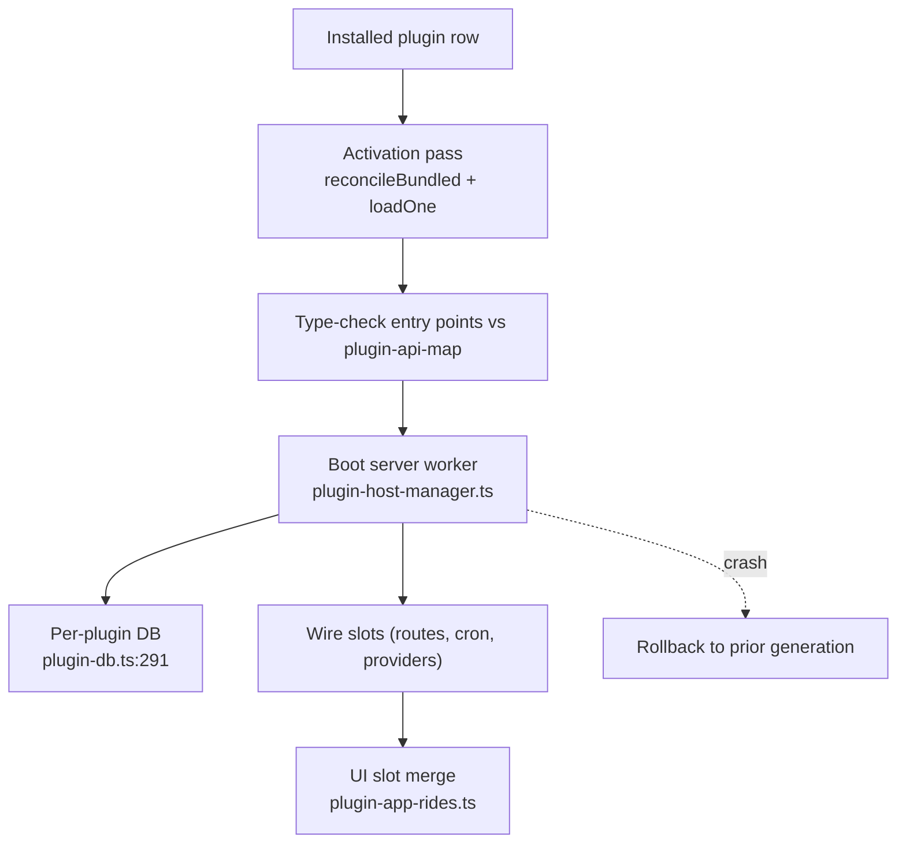
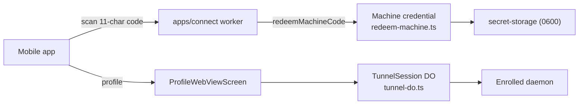

# Workflows: End-to-End Flows

This document walks the flows that actually move bb state, from a single keystroke in the web app to a row in SQLite or a bridge packet on a daemon. Each flow is written so it can be debugged from either end: the *server* side (where policy lives) and the *daemon* side (where execution lives).

---

## WF-1: Sending a Message to a Running Thread

The most common action in bb: the user types in a thread that is already backed by a running provider process, and expects the agent to respond.

### Trigger

- Web app `sendTypeahead`/`send` on `ThreadDetailView` (`apps/app/src/views/thread/ThreadDetailView.tsx`)
- CLI `bb threads send` or SDK `sendThreadMessage` (`packages/sdk/src/core/threads/send.ts`)
- Plugin via `app.slots.cli.command` / programmatic `server.dispatch`

### Steps

**1. Server accepts and validates.** `sendThreadMessage` in `apps/server/src/services/threads/thread-send.ts:459` validates the message against the thread's turn-ready state, resolves the *execution plan* (`resolveExistingThreadExecutionPlan` in `apps/server/src/services/threads/execution-plan.ts`), and locks the server-side "manager" ownership.

**2. Queue if the thread is mid-turn.** If the thread already has a running dispatch, the message is instead upserted as a `queuedThreadMessages` claim and the action is parked. The queue row is *deleted only by the transaction that dispatches it* (compare-and-swap semantics, `dispatch-attempt.ts:653`), so a crash cannot double-send.

**3. Dispatch.** `runDispatchAttempt` (`apps/server/src/services/threads/dispatch-attempt.ts:290`) issues a `thread.start` daemon command with `expectedTurnId`, opens the gate for the new turn, and hands control to the runtime's command automation. The runtime (on the daemon, `packages/agent-runtime`) boots the provider bridge and streams deltas.

**4. Events persist and fan out.** Each provider delta is normalized into a typed `ThreadEvent` (e.g. `client/turn/requested`, `turn/completed`, `thread-start-tw/kickoff`) and appended to the `events` table (`packages/db/src/schema.ts:775`). `NotificationHub` coalesces (`apps/server/src/ws/hub.ts:422`) and pushes one `events-appended` to subscribed sessions. The web app's `realtime-cache-effects.ts` patches its TanStack Query cache accordingly.

**5. Steer and settle.** While the turn runs, the user can `send` again or `stop`; a follow-up `turn.submit(turnId)` on the daemon carries the next message. Turn completion writes `turn/completed`; the log records the full session on `Cmd.close`.

### Failure modes & recovery

- Daemon offline → server parks the message as queued; the `PeriodicSweepJob` roster (`apps/server/src/services/periodic-sweeps/periodic-sweeps.ts`) retries once the daemon re-enrolls.
- Provider dies mid-turn → bridge emits a `RuntimeStopReason`; server reconciles the thread to a terminal state and surfaces the crash reason to the timeline.
- Double dispatch prevented by the compare-and-swap claim, not by a lock; see ADR-1 (single-writer) in `2.Architecture.md`.

---

## WF-2: Provisioning an Environment (First Run of a Thread)

Threads run inside a *workspace*: a git-cloned directory with a specific provider/worktree/environment profile. First run means the environment is missing and must be provisioned before any provider process starts.

### Trigger

- New thread created from the `New Thread` flow (`apps/app/src/views/new-thread/NewThreadView.tsx`)
- SDK `createThread` with an environment descriptor

### Steps

**1. Reservation.** The server writes an environment reservation (`environment-engine.ts:1571` `advanceEnvironmentProvisioning`) and marks the thread's environment as `provisioning`. No provider process can start against a non-provisioned environment.

**2. Lazy worktree creation.** The worktree directory is created on demand — cloning is deferred until actually needed, keeping first-render cheap (local features only when config allows).

**3. Provider boot.** Once the environment is provisioned, `resolveExistingThreadExecutionPlan` finally picks the provider; the daemon's `runtime-manager.ts` launches the provider CLI (Codex/Claude/Pi/ACP) inside the workspace.

**4. Teardown.** A finished environment is *not* destroyed silently: `sweepProviderLifecycles` (`apps/server/src/services/environments/env-sweeper.ts`) tears down provider processes but leaves the workspace for future turns until explicitly archived.

### Notes

- Environments are server-owned *policy*, not daemon-owned state: the daemon never decides "which environment name means what".
- A misconfigured environment aborts the reservation cleanly; the thread stays in `environment not provisioned` and exposes the exact suffix of the error on the timeline.

---

## WF-3: Routing a Command to an Enrolled Host Daemon

Remote usage: a server (this machine, or inside a desktop binary) controls an *enrolled* daemon on another machine. Every daemon command is settled, never fire-and-forget.

### Trigger

- Admin enables a remote host; web app lists enrolled machines (`/hosts`)
- Server needs to start a thread whose execution plan points at a remote host

### Steps

**1. Route resolution.** The server computes the daemon's identity from the thread's `host` and looks up the matching online connection in `ws/hub.ts`. If the daemon is offline, the command is rejected with a clear `daemon offline` reason instead of being silently dropped.

**2. Live RPC.** `requestHostOnlineRpc` (`apps/server/src/ws/hub.ts:727`) allocates a request id, serializes the command per `HOST_DAEMON_PROTOCOL_VERSION = 215`, and awaits the daemon's typed result. Permission ceilings are checked server-side (`getHostPermissionCeiling`).

**3. Daemon executes.** `apps/host-daemon/src/command-router.ts` validates the command, runs the primitive (start a process, open a terminal, read a file), and streams raw host-local events back. The daemon *never* makes product policy — it returns raw state, and the server assembles product behavior (ADR-5).

**4. Settlement.** The daemon echoes the operation result (plus new turn ids where applicable). The server reconciles its DB and notifies the UI. If the socket drops mid-flight, the command's outcome is reconciled on reconnect by the sweeps.

### Notes

- Versioning trumps improvisation: a wire change must bump `HOST_DAEMON_PROTOCOL_VERSION`, per `AGENTS.md` and ADR-6.
- The permission ceiling is server-computed, so a remote daemon can never widen the user's on-box policy; it only reports what it was asked to do.

---

## WF-4: Plugin Activation and Boot

Plugins are the extension spine of bb. A *bundled* plugin ships inside the app; a *marketplace* plugin is installed by a `plugin.install`. Either way, activation is a supervised, provenance-checked boot.

### Trigger

- App start (`PluginRegistryService` activation pass)
- User installs a plugin (`/plugins`, CLI `bb plugins install`, SDK `installPlugin`)

### Steps

**1. Registry/activation.** `plugin-runtime.ts` `loadOne` (`apps/server/src/services/plugins/plugin-runtime.ts:1357`) loads the plugin's bundled artifact. Provenance is enforced: a packaged app must never run a builtin plugin from another installed app (`docs/plugin-provenance.md`); `reconcileBundled` keeps the previous row when the resolved path has no readable manifest.

**2. Type contract.** The plugin's discovered entry points are type-checked against the plugin API map (`packages/plugin-api-map`); the server refuses to activate a plugin that misdeclares its slots.

**3. Server/worker boot.** The plugin's `server.js` runs in a dedicated Node worker (`plugin-host-manager.ts`) with its own plugin-scoped SQLite database (`services/plugins/plugin-db.ts:291`). Slot hooks (`app.slots.server.routes`, `app.slots.server.backgroundCron`, `app.slots.providers.programmatic`) are wired.

**4. App/UI slots.** UI plugins contribute to the web app via the shared app hub; `plugin-app-rides.ts` merges slot renderers. Crash -> deterministic rollback to the previously working generation (ADR-4).

### Notes

- Bundled plugins declare their name in `@bb/bundled-plugins` so Turbo runs `prepare:bundled` before assembly (`packages/bundled-plugins/build.ts`).
- Provenance by artifact, not by UI: `~/.bb/plugin-host-artifacts/<id>/<digest>/host.mjs` must hash to the running app's `dist/host.js`.

---

## WF-5: Connect Cloud Pairing and Remote Access

bb does not *require* the cloud — every flow above works fully local. The connect cloud exists so a phone can pair with, and tunnel into, an enrolled machine.

### Trigger

- User scans a pairing code in the mobile app or runs `bb connect --code ...`

### Steps

**1. Code + exchange.** The mobile app shows an 11-character code from `apps/connect` (Cloudflare Workers). `apps/web/src/routes/api.connect.redeem-machine.tsx` calls `redeemMachineCode` (`packages/connect-client/src/redeem-machine.ts`) which exchanges the code for a machine credential.

**2. Machine credential.** The redeemed credential is stored into `secret-storage` (`packages/secret-storage`, 0600 file) and the machine registers itself; the daemon gets the tunnel endpoints.

**3. Tunnel.** A `TunnelSession` (`apps/connect/src/tunnel-do.ts`, a Durable Object) carries WSS/HTTP between the mobile app, the connect cloud, and the enrolled daemon. The mobile `ProfileWebViewScreen` loads the web app through the tunnel.

**4. Revoke.** `api.connect.revoke-machine.tsx` tears the credential down; `bb connect revoke` does the same from the CLI.

### Notes

- The connect cloud is optional and transparent: if it is unreachable, everything local keeps working (ADR-1).
- Push notifications to the mobile app are routed through the connect cloud (see `packages/connect-db` schema for `connectNotifEndpoint`s).

---

## WF-6: Timeline Rendering (Read Path)

Because threads are event-sourced, rendering is a *projection* — the most-read flow in the system, reusing `@bb/thread-view` on both the server (initial page) and client (scroll-back).

### Steps

**1. Query window.** The client asks for a page of events (`apps/app` `ThreadTimelineRows`), requesting events ≥ a `sequenceIndex`.

**2. Projection.** `buildThreadTimelineWithProfile` (`apps/server/src/services/threads/timeline.ts:1524`) calls `buildThreadTimelineFromEvents` (`packages/thread-view/src/build-thread-timeline.ts:1155`), which walks events and classifies them into conversation/work/turn rows (`buildEventProjection` at `packages/thread-view/src/build-thread-timeline.ts:45`).

**3. Rendering.** The web app merges server timeline + realtime cache patched deltas (`realtime-cache-effects.ts`) and fast-renders the rows with reply affordances (`ThreadTimelineRowRenderer`).

### Notes

- The projection is *deterministic and server-tested*; `@bb/thread-view` has unit tests covering fork/retry/rewind (`packages/thread-view/test/build-thread-timeline.test.ts`).
- Realtime updates patch only the delta, never a full page reload, keeping timeline cost O(changed rows).

---

## Cross-Cutting Guarantee

Every write flow preserves the invariant **"DB row is authoritative; UI is a projection."** Concretely: the web app's TanStack Query cache is owned per-query-key (`query-keys.ts`), mutated only through `cache-owner` mutations, and invalidated only by `realtime-cache-effects`. Nothing in `apps/app` writes to `packages/db` directly, and nothing on the daemon reads product policy. That asymmetry is what makes remote execution and mobile use safe by construction, and it is the through-line of every flow above.