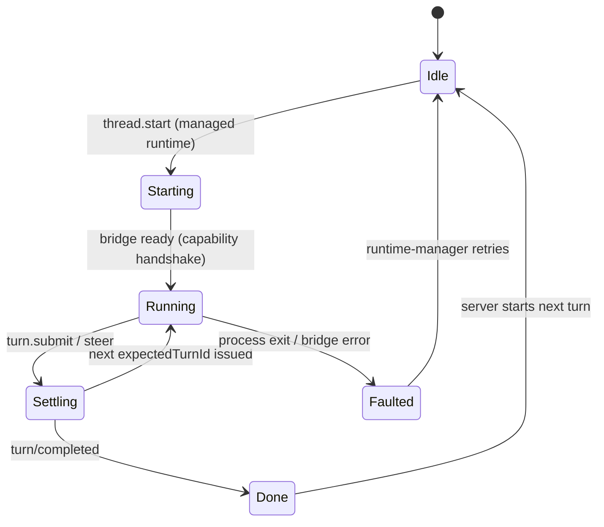
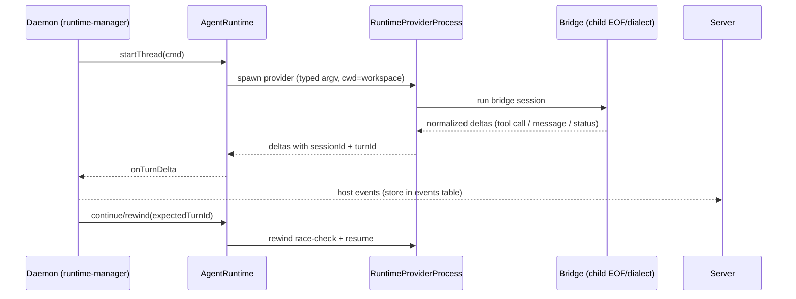

# Deep Exploration — Agent Runtime

**Domain:** provider process lifecycle, turn state machines, deltas, rewind
**Path:** `packages/agent-runtime/`

---

## Overview

Agent runtime is the shared library the host daemon uses to bring a provider process to life and drive it turn by turn. It is the *turn state machine*: it spawns the provider executable, runs the bridge capability handshake, translates raw provider output into normalized typed deltas, tracks which turn the process is on, and answers "continue from `expectedTurnId`" requests (rewind/resume). It is provider-agnostic — everything provider-specific lives in the bridge packages behind `RuntimeProviderProcess`.

Because it runs on the daemon, it returns *raw host-local* facts (turn deltas, process status, bridge errors) and never assembles product policy; the server does that (ADR-5).

### Core File Map

| File | Responsibility |
|------|----------------|
| `src/runtime.ts` | `AgentRuntime` facade: spawn, turn orchestration, subscriptions |
| `src/process.ts` | `RuntimeProviderProcess` — child process lifecycle + wait states |
| `src/types.ts` | Constitutive types: turn ids, deltas, `RuntimeRequest`, session identity |
| `src/protocol.ts` | Bridge protocol plumbing (host side) |
| `src/rewind.ts` / turn math | `expectedTurnId` negotiation + rewind/summary |

## Key Design Decisions

- **A provider is a process + a bridge.** Agent runtime knows the *shape* of the work (turns, deltas, waits) but not the dialect. Dialect translation is the bridge's job (`provider-bridges.md`).
- **Turn ids are causal, not random.** The runtime derives the next turn id from the current one, so the server's `expectedTurnId` gate doubles as both an ordering and a validation token.
- **Everything is a typed delta.** Provider screenscrape and tool calls are normalized to `Cmd`-family deltas; the server stores them verbatim in the `events` table.

## Core Components (Functions/Types)

| Token | Location | Role |
|-------|----------|------|
| `AgentRuntime` | `src/runtime.ts` | Public facade for the daemon's runtime-manager |
| `RuntimeProviderProcess` | `src/process.ts` | Spawn, wait, kill, rewind of one provider child |
| `RuntimeRequest` + `RuntimeTurnDelta` | `src/types.ts` | Constitutive request/delta typed shapes |
| Bridge hosting | `src/protocol.ts` | Start/pause/continue a bridge session |
| Turn math | `src/rewind.ts` | `expectedTurnId` derive + rewind path |

## Turn State Machine

## Delta Flow

## Data Model

No durable rows live here; the runtime's "state" is the in-memory turn map plus the `ProcessWait` table mirrored by the daemon for crash recovery. Deltas it emits become rows in the server's `events` table (`packages/db/src/schema.ts:775`).

## Interactions

- **Runs inside:** `apps/host-daemon/src/runtime-manager.ts`.
- **Speaks to:** bridge packages (`packages/provider-bridge-protocol`, `packages/provider-bridge-acp`) — which decide the actual dialect.
- **Feeds:** host events protocol → server → event store + timeline.

## Performance

- Delta fan-out is batch-friendly; a busy provider turn is a steady stream, and the runtime coalesces status flushes.
- Rewind/continue is a single in-memory check against `expectedTurnId`, no DB round-trip on the daemon.

## Implementation Highlights

- **Causal turn ids** make mid-turn steering safe (WF-1): the server never worries about two "send" commands racing, only about ids crossing wires.
- **Process wait states** (`types.ts:296`) let the daemon answer "why isn't the provider producing?" with a typed reason (awaiting tool, awaiting user, running) that surfaces directly on the timeline.
- **Provider-agnostic contract.** Writing a new provider = writing a bridge that satisfies `RuntimeProviderProcess`; agent runtime never changes. Proof: `provider-acp` reuses the exact same host plumbing as `provider-codex`.

Sibling docs: `host-daemon.md`, `provider-bridges.md`, `provider-services.md`, `thread-services.md`.