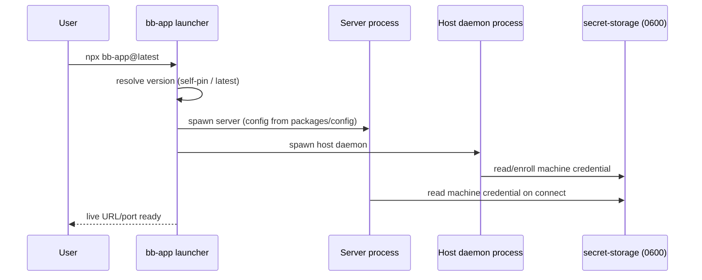

# Deep Exploration — bb-app Launcher & Secret Storage

**Domain:** the published npm launcher + host-local secret management
**Path:** `packages/bb-app/`, `packages/secret-storage/`

---

## Overview

Two small utilities make local installation work without fuss.

**`bb-app`** is the published npm package (`bb-app@latest`) that turns "install bb" into `npx bb-app@latest` for a server or `bb connect` for a client machine. It self-builds or self-runs the packaged server + host daemon (the same entry the desktop shell invokes at `src/main.ts`), supervises those child processes, and resolves the live URL/port. It is the distribution seam: one command brings up the entire stack local-first.

**`secret-storage`** manages host-local secrets — machine auth credentials, plugin tokens, links — as **0600-permissioned files** under the bb data dir. It exists so credentials never leak into the DB or app logs, and so the *daemon* can hold credentials for its machines without the server ever needing them.

### Core File Map

| File | Responsibility |
|------|----------------|
| `packages/bb-app/src/launcher.ts` | `runBbApp`: spawn + supervise server/daemon children |
| `packages/bb-app/src/util.ts`, `version.ts` | Resolve version/entry, self-pinning |
| `packages/secret-storage/src/secret-file.ts` | Read/write 0600 secret files |
| `packages/secret-storage/src/index.ts` | Namespaced accessors (machine, plugin, link) |

## Key Design Decisions

- **Secrets are files, not env/logs.** Credentials never round-trip through app code's output or the DB; they are read from a 0600 file on demand.
- **Launcher is a supervisor, not a bundler.** It spawns built artifacts produced by the monorepo pipeline; it never rebuilds at runtime (deterministic provenance).
- **Client machines only need `bb-app`.** `bb connect` + `bb-app` = an enrolled machine with zero UI and no source checkout.

## Components

| Component | Location | Notes |
|-----------|----------|-------|
| `runBbApp` | `packages/bb-app/src/launcher.ts` | Spawn server + daemon, supervise, resolve URL/port |
| `bb connect` wiring | `bb-app` bin + `apps/cli` | Pair CLI machine |
| `secret-file` | `packages/secret-storage/src/secret-file.ts` | Atomic 0600 read/write |
| Namespaced accessors | `secret-storage/index.ts` | machine / plugin / link credential domains |

## Flow — `npx bb-app@latest`

## Interactions

- **Desktop shell** (`apps/desktop/src/main.ts`) calls the same launcher inside Electron.
- **CLI** (`bb connect`) drives pairing that stores its result via secret-storage.
- **Server** reads machine credentials at auth time (`apps/server/src/authentication.ts`).

## Implementation Highlights

- **One command equals the whole stack.** `npx bb-app@latest` is the deterministic entry point for server and client enrollment — repeatedly proven by the `--code` enrollment on `apps/web/src/routes/dashboard.tsx:691`.
- **Secrets stay host-local by design.** The server orchestrates machines via `host services`, but never needs to *see* the secret that the daemon holds — smaller blast radius, auditable grants.
- **Supervision with negligible surface:** spawn, watch, restart, report — the whole launcher is a few hundred lines, matching ADR-1's "keep it simple" bias.

Sibling docs: `desktop-shell.md`, `cli.md`, `config.md`, `5.Boundaries-Interfaces.md`.