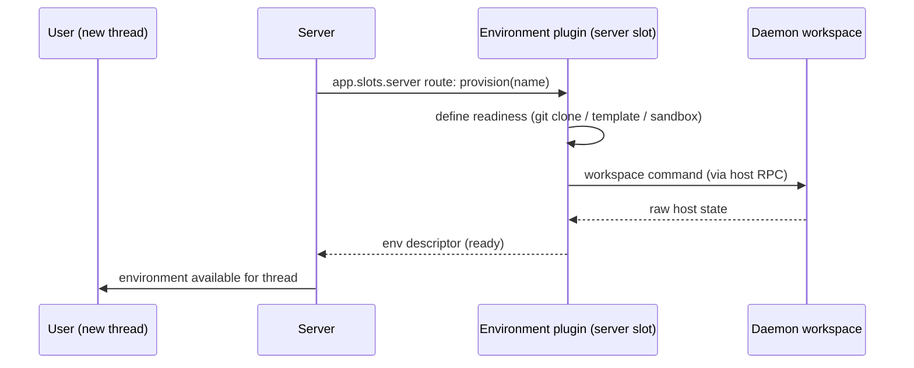

# Deep Exploration — Bundled Plugins (The Arc Distribution)

**Domain:** the 33 shipped plugins — providers, environments, tools, apps, extensions
**Path:** `plugins/`, `packages/bundled-plugins/`

---

## Overview

The Arc distribution ships with a curated set of bundled plugins, each a real implementation of the Plugin SDK surfaces described in `plugin-system.md`. They are grouped into *providers* (`provider-codex`, `provider-claude-code`, `provider-pi`, `provider-acp`), *environments* (`environment-git-worktree`, `environment-personal-workspace`, `environment-project-checkout`, `environment-modal-sandbox`), *agent tools* (`ask-user-question`, `browser-automation`, `github`, `exchange-mail`, …), and *product extensions* (Scheduled Send, Tasks, Memory, Side Chat, Monitor, Workflows, Drafts, Concurrency Limit, Push Notifications, …).

Every plugin has source under `plugins/<name>` and must list its package name in `@bb/bundled-plugins` so Turbo runs `prepare:bundled` before assembly happens (`packages/bundled-plugins/build.ts`). The same directory intentionally parks the legacy `bb-official.json` first-party catalog alongside the newer per-plugin sources.

### Core File Map

| File / dir | Responsibility |
|------------|----------------|
| `plugins/<name>/src/` | Plugin implementation (app.tsx / server.ts / host.ts / schema) |
| `packages/bundled-plugins/build.ts` | Registry of bundled plugin names → assembly wiring |
| `plugins/bb-official.json` | Legacy first-party marketplace catalog |
| `packages/scripts/test/bundled-plugin-tasks.test.mjs` | Assembly test enforcing the name-in-deps rule |

## Plugin Groups at a Glance

| Group | Plugins (representative) | Surface used |
|-------|--------------------------|--------------|
| Providers | `provider-codex`, `provider-claude-code`, `provider-pi`, `provider-acp` | `defineProvider` |
| Environments | `environment-git-worktree`, `environment-personal-workspace`, `environment-project-checkout`, `environment-modal-sandbox` | `defineEnvironment*` |
| Agent tools | `ask-user-question`, `browser-automation`, `github`, `drafts`, `tasks`, `exchange-mail` | `app.slots.agentTools` |
| Execution policy | `provider-retry`, `provider-usage`, `concurrency-limit`, `custom-instructions` | server slots + tools |
| Product extensions | `scheduled-send`, `automations`, `workflows`, `memory`, `side-chat`, `docs`, `monaco-editor`, `inline-vis`, `theme-preview`, `keep-awake` | app + server slots |
| Infrastructure | `push-notifications`, `secrets`, `account-pool`, `bb-guide`, `plugin-api-docs` | mixed |

## How a Bundled Environment Plugin Works End to End

## Key Design Decisions

- **Distribution = app + curated plugins.** The "Arc distribution" *is* the bundled set; the marketplace catalog (`bb-official.json`) is the older, broader list and both are maintained behind the same activation path.
- **Reference integrations teach the SDK.** `provider-acp` is the reference for ACP support; `environment-*` plugins are the reference for workspace providers; `ask-user-question` is the reference for interactive tool slots.
- **Assembly is code, not hand-copying.** Bundled plugin names are declared (`bundled-plugins/build.ts`) and the assembly test (`bundled-plugin-tasks.test.mjs`) refuses a plugin that forgot the declaration.

## Interactions

- **Activation/boot:** handled in `plugin-system.md` (registry → `loadOne` → worker → slots).
- **Provenance:** an installed app may never run a builtin plugin from another installed BB/Arc app; artifact hash must match the app's `dist/host.js` (`docs/plugin-provenance.md`).
- **Reference docs:** `plugin-api-docs` and `bb-guide` wrap the SDK so plugin authors can discover slots.

## Performance

- Bundled plugins are lazy-loaded on activation; non-app plugins (`server`/`agentTools`) contribute zero UI payload.
- Per-plugin DB (plugin-db) isolates plugin state writes from the main thread tables.

## Implementation Highlights

- **One distribution, two catalogs:** `plugins/` (source of the 33) and `bb-official.json` (legacy manifest) teach everything about how the platform separates product extensions from core.
- **Env variety is applied policy:** the four environment plugins embody the "server owns policy" ADR — the engine schedules them generically; each plugin owns the *meaning* of its name.
- **`bundled-plugin-tasks.test.mjs` exists to fail loudly** when a plugin forgot to declare its package name — the test is the guardrail for the whole provenance story.

Sibling docs: `plugin-system.md`, `environment-services.md`, `provider-services.md`, `docs/plugin-provenance.md`.