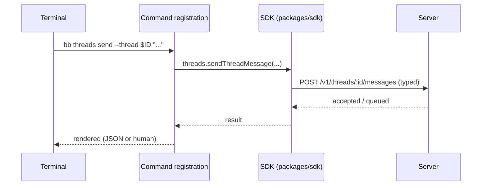

# Deep Exploration — CLI

**Domain:** the `bb` command-line surface — everything the server can do, from a terminal
**Path:** `apps/cli/`

---

## Overview

The CLI is the scriptable face of bb. It is deliberately **thin**: command groups (`apps/cli/src/command-groups.ts:27`) register commander commands that call the SDK, which talks to the server over HTTP/WS. There is no server logic here; the CLI is a client like the web app, which is what lets it drive remote hosts and connect cloud flows identically. Anything the web app supports but the CLI lacks is a documented gap, not a separate capability (AGENTS.md: "every end-user feature must also be usable through the SDK and bb CLI").

### Core File Map

| File | Responsibility |
|------|----------------|
| `src/command-groups.ts` | Registers all commander groups (status, threads, connects, hosts, plugins, …) |
| `src/commands/` | Per-command implementations (via SDK) |
| `src/register-*` | Browser/connect/plugin registration subcommands |
| `src/connect-command.ts` | `bb connect` flows (pairing, revoke) |
| `src/output.ts` | JSON and human-readable output rendering |

## Key Design Decisions

- **CLI = SDK client.** No duplicated HTTP calls; both paths share `packages/sdk`.
- **Scriptability is a product requirement.** Output is JSON-capable (`--json`), so `bb threads ls`, `bb hosts list`, etc. compose in shell pipelines the same way the UI drives them.
- **Command surface mirrors the contract.** Every server route group has a CLI group (threads, envs, hosts, plugins, settings, connect).

## Components

| Component | Location | Notes |
|-----------|----------|-------|
| Command registry | `src/command-groups.ts:27` | `registerBrowserCommands`, `registerStatusCommand`, … |
| Thread commands | `src/commands/threads.ts` | send, list, steer, fork, archive |
| Env/host commands | `src/commands/envs.ts`, `hosts.ts` | environments + host management |
| Connect | `src/connect-command.ts` | pair, redeem, revoke, status |
| Plugins | `src/commands/plugins.ts` | install/list/remove |
| Output layer | `src/output.ts` | human + JSON renderers |

## Command → SDK → Server

## Interactions

- **SDK:** `packages/sdk` (see `sdk.md`).
- **Server:** public API routes.
- **Connect:** `bb connect` drives the machine-credential pairing (WF-5) so a headless box can enroll itself.
- **Plugins:** plugin CLI slots (`app.slots.cli.command`) attach subcommands to the same registry.

## Implementation Highlights

- **Full-surface parity enforced by SRP design, not by copy-paste:** one SDK, everyone calls it, so the CLI cannot drift from what the web app shows.
- **Headless first-class:** enrollment, revoke, and status all have `--json` paths, which is exactly what automation and the mobile connect flow consume.

Sibling docs: `sdk.md`, `server-core.md`, `host-services.md`, `contracts.md`, `5.Boundaries-Interfaces.md`.