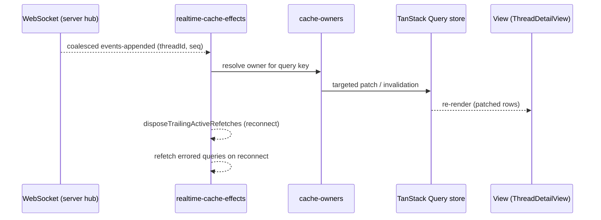

# Deep Exploration — Client State and Realtime

**Domain:** TanStack Query cache ownership and WebSocket-driven invalidation
**Path:** `apps/app/src/hooks/`

---

## Overview

Client state is where bb's "UI is a projection" principle is enforced in code. The web app keeps authoritative state server-side and treats its in-memory query cache as a disposable projection of it. This module owns three things: (1) **query-key identity** (`apps/app/src/hooks/query-keys.ts`, `apps/app/src/hooks/cache-owners.ts`) so every piece of data has exactly one writer, (2) **mutation discipline** (`cache-owners` mutations) so writes go through the server and only the owner updates the cache, and (3) **realtime effects** (`apps/app/src/hooks/realtime-cache-effects.ts`) that connect WebSocket `events-appended` pushes and patch the right caches.

The payoff: offline reconnect, multi-tab, and concurrent plugin updates all behave — because no two consumers ever fight over the same cache slice.

### Core File Map

| File | Responsibility |
|------|----------------|
| `apps/app/src/hooks/query-keys.ts` | Canonical query-key factory (thread, env, host, plugins, …) |
| `apps/app/src/hooks/cache-owners.ts` | Declares who owns each cache slice; mutation guards |
| `apps/app/src/hooks/realtime-cache-effects.ts` | WS subscription, patch, reconnect, refetch-errored-on-connect |
| `apps/app/src/hooks/useThreadTimeline.ts` | Timeline query wrap (server projection + delta patch) |
| `apps/app/src/hooks/useThreadSend.ts` | Send/steer mutation (through server, then cache patch) |

## Key Design Decisions

- **One owner per query.** `cache-owner` = the hook authorized to mutate a query key. No scattered `queryClient.setQueryData`.
- **Realtime patches, never full reloads.** `events-appended` carries deltas; the effect maps them to owner patches. A reconnect refetches only queries that errored (`refetchErroredRealtimeQueriesOnInitialConnect`, `apps/app/src/hooks/realtime-cache-effects.ts:574`).
- **All writes are server round-trips.** No optimistic writes bypass the server, so the cache and DB cannot disagree on causal ordering.

## Data Flow

## Interactions

- **Server hub:** `apps/server/src/ws/hub.ts` (coalesced `events-appended`).
- **Plugin app slots:** plugin views consume the same hooks; cache-owner guarantees their caches never collide with core views.
- **Timeline:** patched rows flow into `ThreadTimelineRows` renderer (see `web-app-ui.md`).

## Implementation Highlights

- **Reconnect logic is the hard part, and it is minimal:** trailing refetches are disposed (`apps/app/src/hooks/realtime-cache-effects.ts:486`), errored queries refetched once on connect (:574) — no reconnect storm, no stale-blank UI.
- **Query keys are a single source of truth** (`apps/app/src/hooks/query-keys.ts`), so "which cache does this event touch?" is answerable by grepping one factory.
- **Ownership is enforced, not conventional.** If a hook mutates a key it does not own, that is a bug you notice because the mutation simply won't render — the discipline is structural.

Sibling docs: `web-app-ui.md`, `server-core.md`, `thread-services.md`.