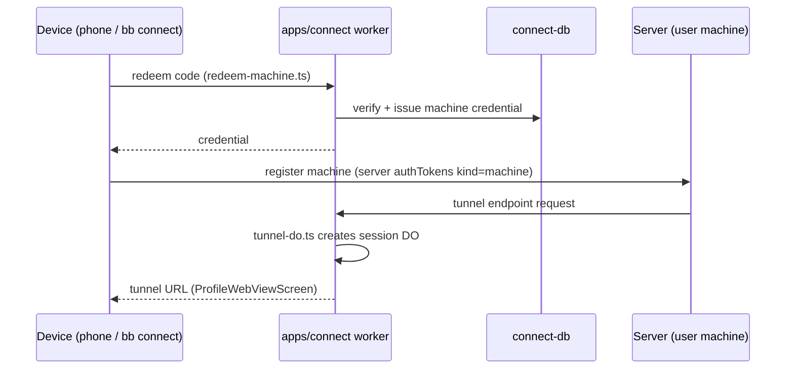

# Deep Exploration — Cloud Connect & Web

**Domain:** machine pairing, tunnels, marketplace — the optional cloud presence
**Path:** `apps/connect/`, `apps/web/`, `packages/connect-db/`, `packages/connect-client/`, `packages/tunnel-*/`

---

## Overview

Connect is bb's optional cloud layer, and it is deliberately *small*: pairing (machine credentials), tunneling (Durable Objects), and the public marketplace/web site. Everything local works without it (ADR-1); connect exists so a phone/remote machine can find and reach a server that lives behind NAT. The stack is edge-native: Cloudflare Workers + Durable Objects for the API, TanStack Start for the marketing/marketplace site, and a tiny client package (`connect-client`) that the mobile app and CLI use to redeem pairing codes.

### Core File Map

| File | Responsibility |
|------|----------------|
| `apps/connect/src/worker.ts` | Cloudflare Worker: pairing/tunnel API |
| `apps/connect/src/servers.ts` / `tunnel-do.ts` | Server registry + per-session tunnel Durable Object |
| `packages/connect-client/src/redeem-machine.ts` | `redeemMachineCode` client |
| `packages/connect-db/src/schema.ts` | Cloud-side rows (machines, sessions, push endpoints) |
| `apps/web/src/routes/` | `api.connect.*` routes + marketing/marketplace pages |
| `apps/web/src/routes/dashboard.tsx` | `bb connect` enroll instructions (`npx -p bb-app@latest bb connect --code …`) |

## Key Design Decisions

- **Cloud is an enabling layer, not the single source of truth.** Truth stays in local SQLite; the cloud holds only pairing/credential/session/tunnel rows for reachability.
- **Tunnels are per-session Durable Objects** (`tunnel-do.ts`), so a tunnel session is stateful-but-private and dies when the session ends — no long-lived NAT poke.
- **One redeem client used everywhere.** `redeemMachine.ts` is shared by the mobile app and `apps/web` dashboard flow; headless enrollment uses the same code path (`bb connect --code`).

## Components

| Component | Location | Notes |
|-----------|----------|-------|
| Worker API | `apps/connect/src/worker.ts` | Pairing, servers, sessions, notifications |
| Tunnel DO | `apps/connect/src/tunnel-do.ts` | WSS/HTTP tunnel per session |
| Client | `packages/connect-client/src/redeem-machine.ts` | Code exchange → machine credential |
| Cloud DB | `packages/connect-db/src/schema.ts` | machines, `connectNotifEndpoint`s, sessions |
| Web site | `apps/web/src/routes/` | api.connect.* + marketplace + download pages |

## Pairing Flow (recap, from WF-5)

## Interactions

- **Server-side daemon:** talks to tunnels to receive remote commands (WF-5).
- **Mobile:** pairs + pushes via connect (see `mobile-app.md`).
- **Web:** dashboard shows `bb connect --code`/marketplace; `api.connect.revoke-machine.tsx` revokes.

## Performance

- Edge worker = near-zero latency for pairing handshake; tunnel DOs scale per session.
- Push endpoints are per-device rows in connect-db, so notification fan-out is a query, not a broadcast storm.

## Implementation Highlights

- **`bb connect` is headless-enrollment.** One CLI command pairs a CI box or laptop with zero UI — the same redeem path the phone uses.
- **Tunnel lifespan = session lifespan.** No page of "your tunnel URL forever"; DOs reap on session close.
- **A tiny contract, a big difference.** The connect surface is ~6 routes; keeping it that small is what keeps the cloud presence maintainable.

Sibling docs: `mobile-app.md`, `host-services.md`, `6.Database-Overview.md` (connect-db tables).