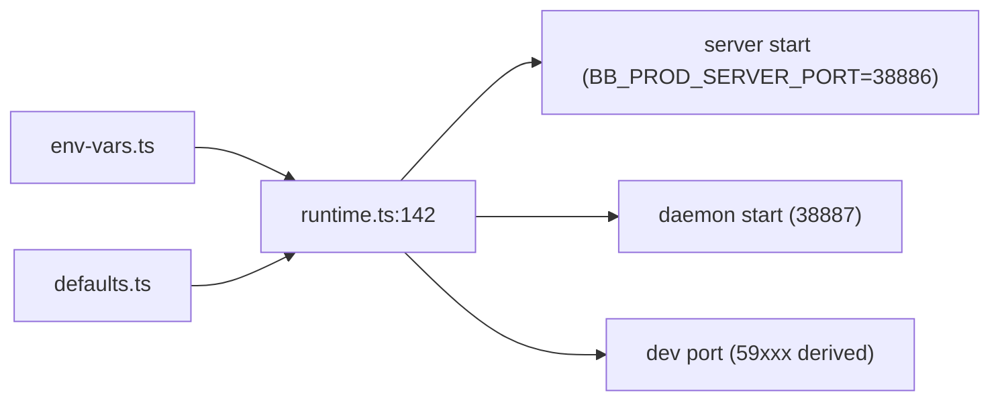

# Deep Exploration — Config

**Domain:** defaults, environment variables, ports, per-mode instance config
**Path:** `packages/config/`

---

## Overview

Config is a tiny but load-bearing package: every server, daemon, CLI, and app build starts from it. It owns the *defaults* (URLs, ports, data dirs), the *env-var surface* (every `BB_*`/`ARC_*` knob), and per-mode instance configuration (`dev`, `prod`, `test`). Because defaults are centralized, a port change or a data-dir relocation is a one-line change with a single source of truth rather than a hunt through call sites.

### Core File Map

| File | Responsibility |
|------|----------------|
| `src/defaults.ts` | Default URLs, names, data dir (`~/.bb`), timeouts |
| `src/env-vars.ts` | Env-var channel + parsing/validation |
| `src/runtime.ts` | Ports: `BB_PROD_SERVER_PORT = 38886`, `BB_PROD_HOST_DAEMON_PORT = 38887` (lines 83–84) + dev/test port mapping (line 142) |
| `src/server-config.ts` / `instance-config.ts` | Per-mode instance config shape |

## Key Design Decisions

- **Defaults are code, not scatter.** What isn't overridable via env is a constant here; what is overridable flows through `env-vars.ts` only.
- **One prod port, mapped dev/test ports.** Production always uses 38886/38887; dev/test derive ports to avoid collisions (line 142) — so CI and local dev never fight the user's real server.
- **Configuration is read once at start.** Values are resolved at boot and passed explicitly through routes/commands (AGENTS.md's "fill defaults once at the service boundary").

## Components

| Component | Location | Notes |
|-----------|----------|-------|
| Defaults | `src/defaults.ts` | data dir, URLs, feature defaults |
| Env channel | `src/env-vars.ts` | `BB_*` parsing + validation |
| Ports | `src/runtime.ts:83-84`, `:142` | prod ports + dev/test mapping |
| Instance config | `src/instance-config.ts` | per-mode deep config |

## Flow — Resolve a Port

## Interactions

- **Server:** `apps/server/src/start-server.ts:94` reads ports + data dir from here.
- **Daemon:** connects to the server port resolved here.
- **CLI:** `apps/cli` resolves `--url`/default URL from config before building SDK.

## Implementation Highlights

- **Port collusion prevention:** dev/test auto-derive ports, so "my server is on 38886" never conflicts with a test harness.
- **Env surface is documented, not guessed**: `docs/cli-guide-and-skill.md` lists every env var and setting; changing one requires updating that guide (AGENTS.md CLI rule).
- **One prod number, many derived numbers:** the `runtime.ts` mapping function (line 142) is the single divergence point for environments.

Sibling docs: `server-core.md`, `host-daemon.md`, `5.Boundaries-Interfaces.md` (env-var table), `docs/cli-guide-and-skill.md`.