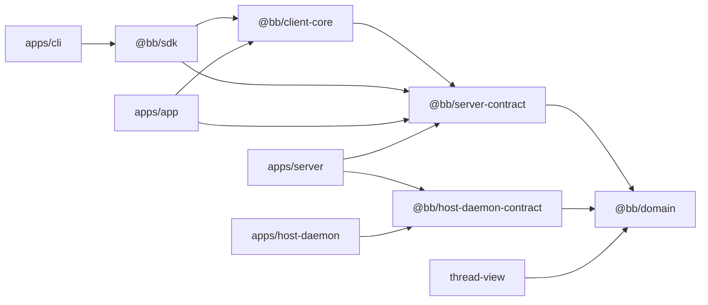

# Deep Exploration — Contracts

**Domain:** the typed wire schema layer — server, host daemon, client-core, domain
**Path:** `packages/server-contract/`, `packages/host-daemon-contract/`, `packages/client-core/`, `packages/domain/`

---

## Overview

Contracts are the backbone that makes bb's many processes interoperable without ad-hoc JSON. There are four layers:

1. **`@bb/server-contract`** — the public API schema: every HTTP route's request/response and every WebSocket message (`packages/server-contract/src/public-api.ts`). The server *and* all clients import it.
2. **`@bb/host-daemon-contract`** — server↔daemon protocol, gated by `HOST_DAEMON_PROTOCOL_VERSION = 215` (`packages/host-daemon-contract/src/protocol.ts`).
3. **`@bb/client-core`** — shared logic/utilities client-side (query keys, subscription helpers) that the web app and SDK both use.
4. **`@bb/domain`** — domain types and event primitives (`thread-events.ts`, `cmd`, deltas) that cross every boundary.

Because everything is zod-schematized and *shared*, a contract change is a compile-time event across every consumer tower — server fails if it forgot to implement, clients fail if they call something removed.

### Core File Map

| Package | Key files | Role |
|---------|-----------|------|
| `server-contract` | `src/public-api.ts` | Route schema + WS message schema (`typedRoutes<PublicApiSchema>`) |
| `host-daemon-contract` | `src/protocol.ts` | Daemon command/result + version gate (:1) |
| `domain` | `src/thread-events.ts`, `src/deltas.ts`, `src/cmd.ts` | Event/delta/command primitives |
| `client-core` | `src/` | Shared client utilities |

## Key Design Decisions

- **One schema, imported everywhere.** No client re-declares an API shape; drift is a type error before it's a runtime bug (ADR-0 discipline visible in `apps/server/src/server.ts:443`).
- **Version the wire, loudly.** `HOST_DAEMON_PROTOCOL_VERSION` bumps with *any* wire-field change (AGENTS.md); a mismatch refuses rather than misinterprets (ADR-6).
- **Events are the domain's core grammar.** `thread-events.ts` kinds (e.g. `client/turn/requested`, `turn/completed`, `thread-start-tw/kickoff`) are the shared vocabulary the projection package (`thread-view`) and DB event log both rely on.

## Dependency Direction

## Component Inventory

| Contract | Where consumed | Gate |
|----------|----------------|------|
| `PublicApiSchema` routes | server, SDK, cli, app | zod parse at edge |
| `HOST_DAEMON_PROTOCOL_VERSION` | server ↔ daemon | explicit 215 compare |
| `ThreadEvent` union | server, thread-view, app | zod discriminants |
| `Cmd` / deltas | agent-runtime ↔ server | bridge protocol |

## Implementation Highlights

- **The route table is a type.** `apps/server/src/server.ts` types `createApp` against `PublicApiSchema`, so removing a route schema breaks the server compile — you cannot ship a route half-implemented.
- **WS messages are schema'd too.** Client protocol (`apps/server/src/ws/client-protocol.ts`) and daemon protocol (`apps/server/src/ws/daemon-protocol.ts`) both parse against typed schemas; there is no free-form "JSON string of anything".
- **Version discipline is enforced in prose and reviews** (`AGENTS.md`), not just in code — because an old daemon receiving a new shape is a production incident otherwise.

Sibling docs: `server-core.md`, `host-services.md`, `host-daemon.md`, `agent-runtime.md`, `5.Boundaries-Interfaces.md`.