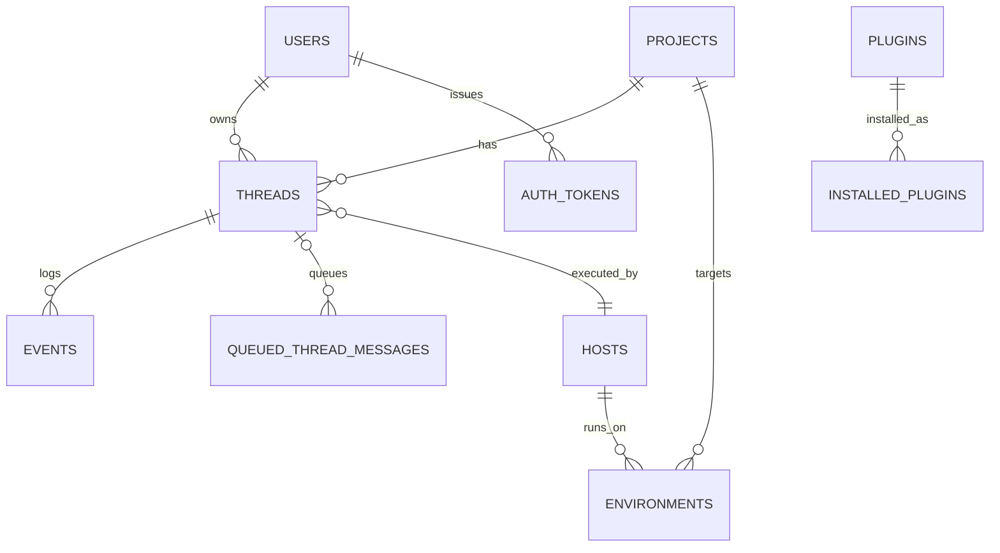
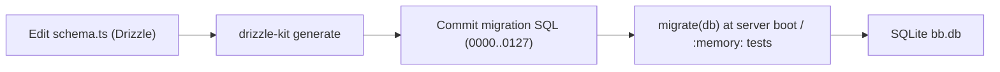

# Deep Exploration — Data Layer (SQLite + Drizzle)

**Domain:** the database schema, migrations, typed access — the single source of truth
**Path:** `packages/db/`

---

## Overview

`packages/db` is bb's persistence backbone: a SQLite database (via better-sqlite3 + Drizzle ORM) accessed only by the server, holding every durable fact — threads, events, projects, hosts, environments, plugins, settings, auth tokens. The two structural pillars are:

1. The **Drizzle schema** (`src/schema.ts`) — typed table definitions.
2. The **128 committed SQL migrations** (`drizzle/0000_baseline.sql` … `0127_*.sql`) — all schema history, never hand-edited (AGENTS.md).

The database is the contract the whole "DB-authoritative" philosophy rests on: nothing renders a fact that isn't a row, and nothing written is trusted until it's a row.

### Core File Map

| File | Responsibility |
|------|----------------|
| `src/schema.ts` | All table definitions; `events` at line 775 |
| `drizzle/` | 128 ordered SQL migrations (baseline … 0127) |
| `src/data/` | Typed data accessors (threads, events, hosts, environments) |
| `drizzle.config.ts` | Drizzle tooling config |
| `src/index.ts` | `createConnection`, `migrate` helpers |

## Key Design Decisions

- **SQLite + single writer (ADR-1).** Local-first, file-copy backups, no external DB to babysit. All writes funnel through one process, so transactions are trivially correct.
- **Schema changes are migrations, not snapshots.** Drizzle schema is the source; migrations/snapshots are *generated* and committed; snapshot JSON is never edited by hand.
- **Events are the store's crown jewel:** append-only `ThreadEvent` log (`schema.ts:775`) — everything else (timeline, forks, retries) is derived from it.
- **Tests never mock the DB.** Tests use `createConnection(":memory:")` + `migrate(db)` (AGENTS.md); no fake in-memory substitution.

## Schema at a Glance

| Table group | Tables | Notes |
|-------------|--------|-------|
| Identity | `users`, `authTokens` | user + machine/daemon actors |
| Work | `projects`, `threads`, `events`, `queuedThreadMessages` | thread lifecycle + event log |
| Execution | `hosts`, `environments`, `worktrees` | enrolled machines + workspaces |
| Extensions | `plugins`, `installedPlugins`, `pluginDatabases` | registry + per-plugin DB |
| Settings | `settings` | server policy + preference rows |

## ER Sketch (core)

## Migration Flow

## Access Patterns

- Server service modules call typed accessors from `src/data/` — no raw `db.run(sql)` scattered through services.
- Queries use targeted `WHERE`/`JOIN`, never load-all-and-filter (AGENTS.md data rule); indexes added only when a query requires them.

## Interactions

- **Author only:** `apps/server` — no other process writes.
- **Readers-come-after-writer:** timeline projection (`thread-view`) reads the same `events` table the send path appends.
- **Plugin DBs:** per-plugin databases are *separate* SQLite files, namespaced by `pluginDatabases` — plugins never touch the core tables.

## Implementation Highlights

- **127 steps of honest history.** `drizzle/0127_*.sql` is literally the schema's git history as SQL, which makes diffing what changed in any release trivial.
- **`:memory:` tests enforce the real thing.** Because tests run the actual Drizzle schema, a migration that the test path would trip over fails in CI, not in production.

Sibling docs: `6.Database-Overview.md` (full tables), `server-core.md`, `thread-services.md`, `contracts.md`.