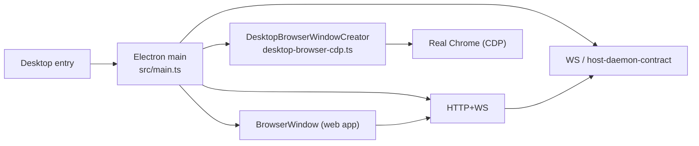

# Deep Exploration — Desktop Shell

**Domain:** Electron desktop distribution — supervises the runtime, browser broker/CDP, auto-update
**Path:** `apps/desktop/`

---

## Overview

The desktop shell is how bb presents itself as a native app: an Electron outer layer that launches and supervises the actual bb runtimes. When you open "BB/Arc" on a laptop, the Electron main process starts the server (via `packages/bb-app` launcher) and the local host daemon, then opens the web app in a `BrowserWindow`. It additionally brokers the **browser automation plugin** (Chrome DevTools Protocol / CDP over a real Chrome instance) and self-updates through the desktop update channel.

The shell is intentionally thin — all bb function lives in the server + web app; the shell only *supervises*.

### Core File Map

| File | Responsibility |
|------|----------------|
| `src/main.ts` | Electron main: app lifecycle, windows, launcher integration |
| `src/desktop-browser-cdp.ts` | `DesktopBrowserWindowCreator` — CDP browser broker for browser-automation |
| `src/updater.ts` (thumbnail) | Auto-update wiring |
| `apps/desktop/src/*.ts` (preload) | IPC bridge into the web app |

## Key Design Decisions

- **Shell ≠ product.** No business logic lives in Electron; the window loads the web app and passes through the URL/port the server was started on.
- **Supervision beats forgiveness.** The shell owns process lifecycle: server + daemon are children; a crashed daemon gets a clean restart (per ADR-5 "daemon is dumb", restart is trivial).
- **Browser automation is a real browser, not a fake.** CDP is brokered to an actual Chrome/Chromium instance so the `browser-automation` plugin controls a genuine browser for the agent (see `desktop-browser-cdp.ts`).

## Components

| Component | Location | Notes |
|-----------|----------|-------|
| `BrowserWindow` | `src/main.ts:150` + `DesktopBrowserWindow` | Hosts the web app |
| `DesktopBrowserWindowCreator` | `src/desktop-browser-cdp.ts` | Opens/controls a real browser via CDP |
| Launcher handoff | `src/main.ts` → `packages/bb-app` | Starts server + daemon, resolves serving URL/port |
| Updater | `src/updater.ts` | Desktop update channel |

## Process Layout

## Interactions

- **Runs:** the packaged server + daemon (through `packages/bb-app`).
- **Listens:** `BB_PROD_SERVER_PORT = 38886` / `BB_PROD_HOST_DAEMON_PORT = 38887` (from `packages/config/src/runtime.ts:83-84`).
- **Brokers:** CDP to real Chrome for browser automation; files and dialogs surface as server dialogues (no native pickers — see AGENTS.md UI rules).

## Implementation Highlights

- **A native app with zero native product logic.** The entire "app" is web code; upgrading the desktop shell never forks product behavior.
- **CDP brokerage is a true abstraction.** `DesktopBrowserWindowCreator` hides parallel-session CDP housekeeping from the plugin, so browser-automation works the same on desktop and server.

Sibling docs: `web-app-ui.md`, `server-core.md`, `config.md`, `bundled-plugins.md` (browser-automation).