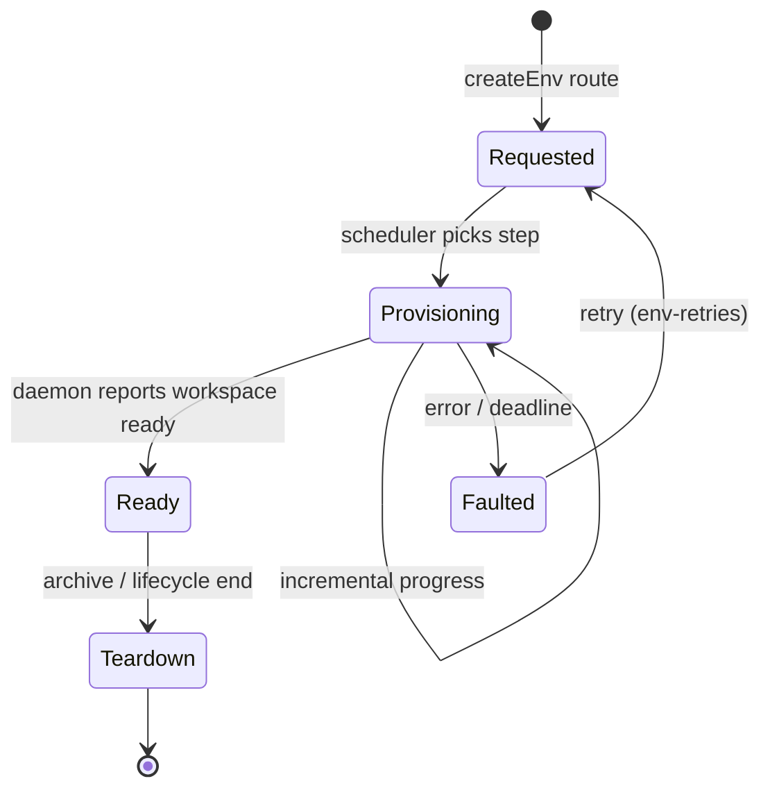
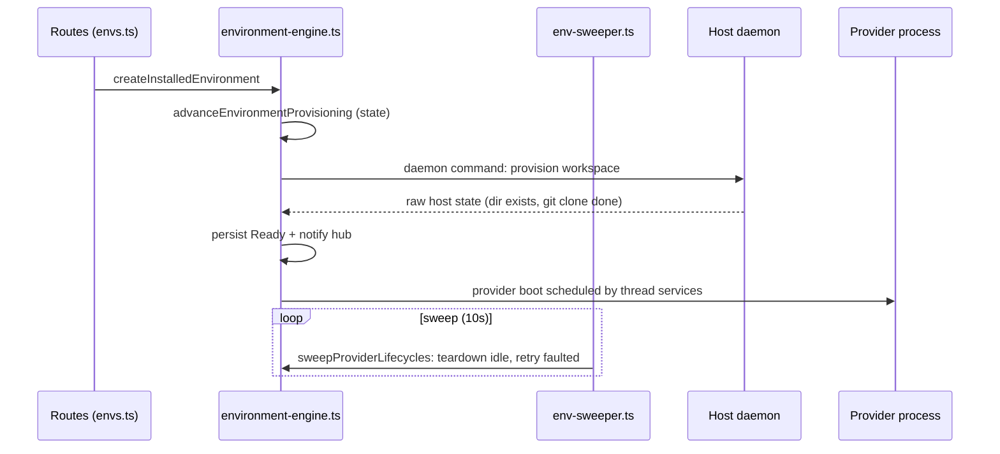

# Deep Exploration — Environment Services

**Domain:** workspace provisioning — create, attach, teardown, lifecycle sweep
**Path:** `apps/server/src/services/environments/`

---

## Overview

An *environment* is a workspace on an enrolled host: a directory where a provider process will run (a project checkout, a git worktree, a personal workspace, or a sandbox). Environments are the "where" of execution. Environment services are the server-side scheduler that moves an environment through provisioning states and keeps provider lifecycles honest — *without* ever provisioning anything itself. Actual directory creation and process spawning are daemon commands; this module decides state transitions and deadlines.

### Core File Map

| File | Responsibility |
|------|----------------|
| `environment-engine.ts` | `advanceEnvironmentProvisioning` — the provisioning state machine |
| `installed-environments.ts` | CRUD + enumeration of installed environments |
| `env-sweeper.ts` | `sweepProviderLifecycles` — teardown/retry on restart or timeout |
| `environment-retries.ts` | Retry/exponential-backoff for provisioning attempts |

## Key Design Decisions

- **Server owns policy, not bytes.** The daemon creates the directory; the server decides when that is required, which provider runs in it, and when the environment is abandoned.
- **Provisioning is a state machine with deadlines.** An environment isn't a boolean flag; it progresses `requested → provisioning → ready → (teardown)`, and each step has a deadline enforced by the sweeper. A half-provisioned environment after a server crash converges to `faulted` rather than staying silently broken.
- **Lazy worktrees.** The worktree is created on demand, so first-render of a thread is cheap; only when a turn actually needs the directory does the clone happen.

## Core Components (Functions)

| Function | Location | Role |
|----------|----------|------|
| `advanceEnvironmentProvisioning` | `environment-engine.ts:1571` | Drive one provisioning step, persist transition |
| `sweepProviderLifecycles` | `env-sweeper.ts` | In-flight provider teardown + retry, deadline enforcement |
| `installedEnvironmentsQuery` / CRUD | `installed-environments.ts` | Register/list/update installed environments |
| Environment enum wiring | `environment-engine.ts` | Name → provider-capability → workspace link |

## Provisioning Lifecycle

## Data Flow

## Data Model

- `environments` — descriptor rows: name, provider, worktree/profile, provisioning state + deadline, attached host.
- Provider lifecycle records are swept server-side; the daemon holds no durable provisioning state (ADR-5). See `6.Database-Overview.md`.

## Interactions

- **Upstream:** `apps/server/src/routes/envs.ts` and the environment picker in `apps/app`.
- **Downstream:** thread services resolve an execution plan only after <em>this</em> module reports `Ready`.
- **Bundled environment plugins** (`environment-git-worktree`, `environment-personal-workspace`, `environment-project-checkout`, `environment-modal-sandbox` in `plugins/`) extend which environments exist; the engine schedules *any* environment the daemon and plugins agree on.

## Performance

- Provisioning steps are DB-transaction-cheap; the expensive workspace clone happens lazily on the daemon.
- Sweeps run on the shared 10 s roster and are guarded with per-job in-flight locks (`periodic-sweeps.ts`), so only one sweep at a time touches a given environment.

## Implementation Highlights

- **Deadline-driven convergence:** every provisioning state carries a deadline; the sweeper moves stale rows forward (retry) or sideways (fault) so a crashed mid-provision cannot wedge a thread forever.
- **Provider lifecycle is swept, not leaked:** `sweepProviderLifecycles` makes sure a provider process that the daemon lost (crash/hang) is reconciled server-side, matching ADR-1's "DB authoritative" invariant.
- **Name = policy seam:** environment *names* (git-worktree, personal-workspace, …) are how bundled and plugin environments are selected, so the engine keeps policy at the boundary and stays agnostic to providers.

Sibling docs: `server-core.md`, `host-daemon.md`, `config.md`, and the environment plugins under `4.Deep-Exploration/bundled-plugins.md`.