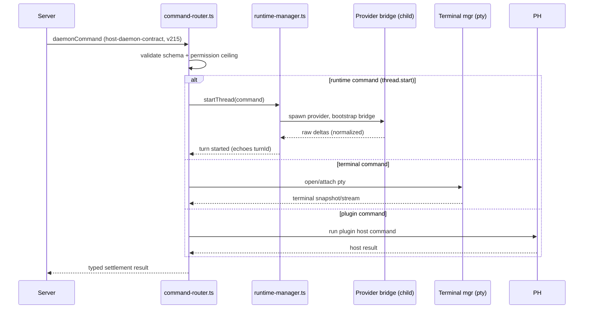

# Deep Exploration — Host Daemon

**Domain:** mandatory local execution — command routing, runtime manager, terminals, plugin hosts
**Path:** `apps/host-daemon/`

---

## Overview

The host daemon is bb's *execution* brain, the mirror to the server's *policy* brain. On every machine that runs work there is a host daemon: it receives typed commands from the server over an authenticated WebSocket, executes the host-local primitive (spawn a provider process in a workspace, open a terminal, read a file, run a git operation), and streams raw host-local events back. It is deliberately **policy-free**: defaults, permissions, provider lists, and instruction modes are all decided server-side and passed *in* the command. The daemon's parts are simple enough to be audited by reading one folder.

A daemon can be on the same machine (`apps/desktop` supervises the local pair) or enrolled remotely; both use the identical `host-daemon-contract` wire protocol at `HOST_DAEMON_PROTOCOL_VERSION = 215`.

### Core File Map

| File | Responsibility |
|------|----------------|
| `src/index.ts` / `main.ts` | Daemon bootstrap: connect, authenticate, subscribe |
| `src/command-router.ts` | Validate typed commands, dispatch to executors, settle outcomes |
| `src/runtime-manager.ts` | Own provider processes, process-waits, turn state machines |
| `src/terminal-manager.ts` | Interactive terminal sessions |
| `src/plugin-host-manager.ts` | Boot per-plugin host workers |
| `src/workspace.ts` | Host-local workspace/config primitive |

## Key Design Decisions

- **Symmetric trust boundary (ADR-5).** The daemon never decides policy. Every command carries its own permission ceiling and tool list; the daemon executes exactly what's asked, nothing more.
- **Settled commands.** Incoming `daemonCommand`s produce an explicit result (success, new turnId, or typed failure) — the server awaits it, so there are no dangling commands.
- **One process family, one workspace.** Workspaces are directories; provider processes are children of the runtime manager; plugin hosts are separate Node workers so third-party code cannot kill the daemon.

## Core Components

| Component | Location | Notes |
|-----------|----------|-------|
| `command-router.ts` | `apps/host-daemon/src/command-router.ts` | zod-validated command dispatch, extension points |
| `runtime-manager.ts` | `apps/host-daemon/src/runtime-manager.ts` | `AgentRuntimeFactory`, process management, turn states |
| `terminal-manager.ts` | `apps/host-daemon/src/terminal-manager.ts` | pty/terminal lifecycle and I/O |
| `plugin-host-manager.ts` | `apps/host-daemon/src/plugin-host-manager.ts` | per-plugin worker boot + crash rollback |
| ProcessWatch table | `runtime-manager.ts` | tracks wait reasons for every child process |

## Command Flow

## Runtime Manager Detail

`runtime-manager.ts` is the daemon's heart. It maintains:

- a map from session/broker to a live provider process,
- a `ProcessWait` table (per process: what is it waiting for),
- turn state machines (`idle → starting → running → settling → done/faulted`) fed by the bridge's typed events,
- rewind/goto support so a server can ask the provider to continue from a specific `expectedTurnId`.

Nothing here imports server-contract; the daemon knows only `@bb/host-daemon-contract` and the bridge protocols. That single import direction is what makes the daemon auditable.

## Data Model

The daemon keeps **no durable business state**. Its only persistence is machine credentials via `packages/secret-storage` (0600 files) and ephemeral process tables. All durable state lives server-side (ADR-1). This keeps the daemon trivially upgradeable and free of migrations.

## Interactions

- **Upstream:** the server (`host-services.md`) — same contract.
- **Lateral (local):** the desktop shell supervises server+daemon; the mobile/web apps reach it only via the server (or a tunnel, WF-5).
- **Plugins:** daemon plugins give the server a `host` RPC namespace; host workers stream results back through the same router.

## Performance

- One settled RPC per command; batch-friendly event streams.
- Workspaces are lazily cloned; process waits are in-memory map lookups (mirrored briefly to a `ProcessWait` table for crash recovery).

## Implementation Highlights

- **Policy-free by construction.** Reading `command-router.ts` shows commands, ceilings, and raw execution — no defaults, no product decisions. That is the documented intent (ADR-5).
- **Version gated.** If the server speaks `HOST_DAEMON_PROTOCOL_VERSION = 216` but the daemon is 215, capability negotiation fails loudly; there is no silent misinterpretation.
- **Plugin isolation.** A crashing plugin host worker is restarted into a clean generation; the daemon itself never runs third-party startup code in the main process.

Sibling docs: `host-services.md` (server half), `server-core.md`, `agent-runtime.md`, `provider-bridges.md`, `contracts.md`.