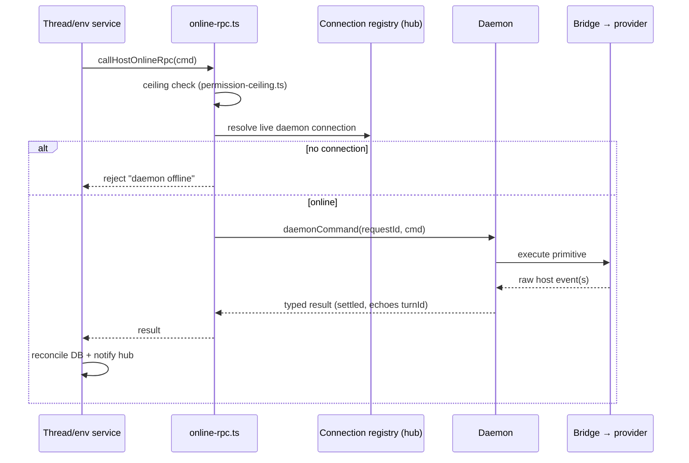

# Deep Exploration — Host Services

**Domain:** host daemon enrollment, live RPC, wake, permission ceilings
**Path:** `apps/server/src/services/hosts/`

---

## Overview

Host services are the server's half of the server↔daemon boundary. A *host* is an enrolled machine running the host daemon that can execute work for this server: provision workspaces, spawn provider processes, run terminals, manipulate git, read files. Even local "desktop" operation goes through this same path — the local host daemon connects to the server exactly like a remote one, just over loopback.

Host services authenticate hosts (they are machines, bearers of a `machineUrl` credential), track their online/offline state, route each daemon command to the right connection, and compute the permission ceiling a command may not exceed. Every command is a *settled* RPC: request id allocated, result awaited, outcome reconciled with the DB.

### Core File Map

| File | Responsibility |
|------|----------------|
| `online-rpc.ts` | `callHostOnlineRpc` — find connection, send request, await typed result |
| `enroll.ts` / `host-registry.ts` | Enrollment, machine credentials, host identity |
| `permission-ceiling.ts` | `getHostPermissionCeiling` — server-computed max capability |
| `wake.ts` | Wake / requery for offline-but-enrolled hosts |
| `apps/server/src/ws/hub.ts` | WebSocket connection registry the RPC layer dispatches over |

## Key Design Decisions

- **Machines are first-class actors.** A `BbActor` of kind `machine` authenticates the daemon; the server never mixes user and machine identity.
- **The daemon is dumb by contract (ADR-5).** It returns raw host-local state; the server assembles policy (permissions, defaults). The daemon can neither widen nor decide the ceiling.
- **Settled commands, not fire-and-forget.** A daemon command without a live connection is rejected with a clear "daemon offline" reason; there is no silent drop.

## Core Components (Functions)

| Token | Location | Role |
|-------|----------|------|
| `callHostOnlineRpc` | `online-rpc.ts` (exported via `ws/hub.ts:727`) | Allocate requestId, await daemon result |
| `getHostPermissionCeiling` | `permission-ceiling.ts` | Compute allowed capabilities for a host+actor |
| Host connection registry | `apps/server/src/ws/hub.ts` | Map machineUrl/broker → live socket + protocol version |
| Enrollment command | `enroll.ts` | Issue machine credential, persist host row |

## Command Flow

## Data Model

- `hosts` — enrolled machines: id, machineUrl, label, enrollment `securityDecided` state.
- `authTokens` (`kind = machine`) / secret-storage machine credentials on the daemon side.

## Interactions

- **Upstream:** everywhere a daemon command is needed — thread dispatch (`dispatch-attempt.ts`), environment provisioning (`environment-engine.ts`), plugin host commands, file/git/terminal actions.
- **Downstream:** the host daemon (`apps/host-daemon`) — same contract both directions.
- **Protocol versioning:** a mismatched `HOST_DAEMON_PROTOCOL_VERSION = 215` produces a capability negotiation, never a guess.

## Performance

- Connection lookup is a map from machineUrl/broker; command settlement is one await on a WS frame.
- Coalescing in the hub keeps the event fan-out cheap even with many hosts attached.

## Implementation Highlights

- **Ceilings live server-side.** `getHostPermissionCeiling` means a remote daemon cannot widen what the user allowed locally — the ceiling follows the user, not the machine.
- **Clear offline semantics.** "Daemon is offline, here's the reason" is a typed rejection, which makes scheduling decisions (queue vs fail) explicit in thread services.
- **Wake path.** Offline-but-enrolled hosts get a wake/requery attempt, keeping the "laptop asleep, work queued" UX smooth without background processes.

Sibling docs: `host-daemon.md` (the other half), `server-core.md`, `thread-services.md`, `contracts.md`.