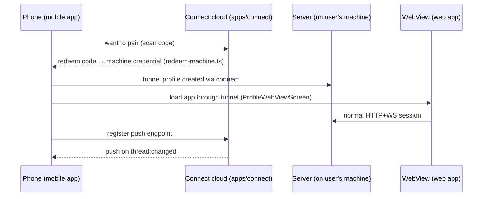

# Deep Exploration — Mobile App

**Domain:** Expo/React Native client for on-the-go access — connect pairing, profiles, push
**Path:** `apps/mobile/`

---

## Overview

The mobile app turns a phone into a thin remote control for bb: pair with a server over the connect cloud, then view/steer threads through a WebView of the web app, with push notifications for thread activity. Mobile does not reimplement the UI — it *loads* the web app through a tunnel-profile WebView — because the web app is the first-class client. What mobile genuinely owns is the native shell: pairing/connect profiles, offline recap, push-notification registration, and the deep-link/wallet-less SSO handshake.

### Core File Map

| File | Responsibility |
|------|----------------|
| `app/_layout.tsx` | Root stack + routing (connect → profile → webview) |
| `app/connect/` | Pairing flow: scan/generate connect code |
| `app/webview.tsx` + `ProfileWebViewScreen` | Tunneled web app container |
| `app/dev/`, `app/e2e/` | Dev QA harnesses |
| `app/+native-intent.tsx`, `+not-found.tsx` | Deep meaning of native intents / fallbacks |
| Push host | Register we push endpoints against connect cloud |

## Key Design Decisions

- **WebView shell, not reimplementation.** The phone shows the same web app; contrast with a native-first mobile client. This keeps feature parity 1:1 and defers mobile-specific native work to the connect layer.
- **Profiles are the pairing unit.** A profile = one server endpoint (local tunnel or connect tunnel); swapping profiles is how you reach different machines. (`apps/connect`, `packages/connect-db` back these.)
- **Push is server-orchestrated.** The connect cloud records a mobile push endpoint; thread events translate to notifications server-side (`push-notifications` bundled plugin participates).

## Components

| Component | Location | Notes |
|-----------|----------|-------|
| Root stack | `app/_layout.tsx` | Connect/profile/webview navigation |
| `ProfileWebViewScreen` | `app/webview.tsx` | WebView over tunneled web app |
| Connect pairing | `app/connect/` | `redeemMachineCode` → profile |
| Push host | native | Registers push endpoint with connect cloud |
| `webview.tsx` | `apps/mobile/app/webview.tsx` | Injected bridge for native↔web messages |

## Pairing & Session Flow

## Data Model (mobile side is all remote)

The phone stores only: connection profiles (endpoint + credential refs) and push registration tokens against the connect cloud (`packages/connect-db`). All thread/environment/host state lives on the paired server (`6.Database-Overview.md`). This is ADR-1 applied to the client end: the phone is deliberately stateless.

## Interactions

- **Cloud:** pairing + tunneling through `apps/connect` and `packages/connect-client` (`redeem-machine.ts`).
- **Web app:** `ProfileWebViewScreen` hosts the same bundle the desktop shell uses.
- **Push:** thread notifications round-trip through connect cloud to the OS push service.

## Implementation Highlights

- **Pairs, tunnels, streams.** Mobile's entire "-native" surface is pairing + tunnel + notifications; everything else inherits web app behavior by construction.
- **Stateless for a reason.** If you wipe the phone, nothing of bb is lost — re-pair and you're back. That's the same "DB is authoritative" stance everywhere.

Sibling docs: `cloud-connect.md`, `web-app-ui.md`, `server-core.md`, `6.Database-Overview.md`.