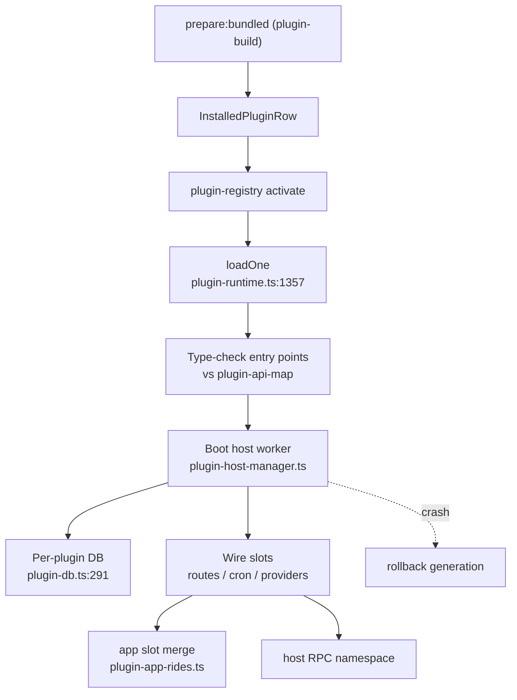

# Deep Exploration — Plugin System

**Domain:** extension platform — SDK, build pipeline, activation, marketplace, provenance
**Path:** `packages/plugin-sdk/`, `packages/plugin-build/`, `packages/plugin-registry/`, `packages/plugin-api-map/`, `apps/server/src/services/plugins/`

---

## Overview

Plugins are how bb becomes a platform. A plugin is a typed, bundled artifact that can extend every surface at once: app UI slots, server RPCs and background crons, agent tools, provider registration, CLI subcommands, environment and machine providers. The Plugin SDK exposes a type-checked `BbPluginApi` (`packages/plugin-sdk/src/backend-contract.ts:2018`) that shares contract types with the server, so the SDK and implementation cannot drift (the same shared-schema discipline as the server contract).

Plugins are built by `plugin-build` (an esbuild-based pipeline), activated by the server's `plugin-runtime`, shipped in bundles by `@bb/bundled-plugins`, and verified by *artifact provenance* (hashing) before they run. `plugin-api-map` audits every public surface the SDK exposes.

### Core File Map

| File | Responsibility |
|------|----------------|
| `packages/plugin-sdk/src/backend-contract.ts` | `BbPluginApi` server-side contract (types:2018) |
| `packages/plugin-sdk/src/app-contract.ts` | `definePluginApp` + app slots (types:1584/1587) |
| `packages/plugin-sdk/src/host-contract.ts` | Host/daemon RPC types for plugins |
| `packages/plugin-build/src/` | `prepare-bundled` pipeline (esbuild bundle → `app.js`/`server.js`/`host.js`) |
| `packages/plugin-registry/src/` | Registry, activation, rollback generations |
| `packages/plugin-api-map/src/surfaces.ts` | Public surface audit map |
| `apps/server/src/services/plugins/plugin-runtime.ts` | `loadOne` activation (line 1357) + slot wiring |
| `apps/server/src/services/plugins/plugin-db.ts` | Per-plugin scoped SQLite DB (line 291) |
| `apps/server/src/services/plugins/plugin-host-manager.ts` | Worker boot + crash rollback |

## Key Design Decisions

- **Types-only public SDK.** Client code imports types from `@get-bb/plugin-sdk`; everything else is generated built artifacts. The API map keeps "what may a plugin touch" explicit and auditable (`.terrain/human` companion: `docs/api_to_audit.md`).
- **Process + artifact isolation.** Each plugin runs in its own Node worker with its own SQLite DB. A crash rolls back to the previous working generation (ADR-4). Provenance is proven by artifact hash, not by UI claims (`docs/plugin-provenance.md`).
- **Slots everywhere, one hub.** App, server, host, CLI, and provider surfaces all emerge from `app.slots.*`; the shared app hub (`plugin-app-rides.ts`) merges them.

## Activation Flow

## Surface Map (what a plugin can touch)

| Surface | SDK entry | Where it lives |
|---------|-----------|----------------|
| App UI slots | `definePluginApp` (`app-contract.ts:2688`) | `apps/app` + `packages/plugin-app-rides.ts` |
| Server RPC / routes | `app.slots.server.routes` | `apps/server/src/services/plugins/` |
| Background cron | `app.slots.server.backgroundCron` | server plugin runtime |
| Agent tools | `app.slots.agentTools` / tool registry | `packages/plugin-api-map` |
| CLI subcommands | `app.slots.cli.command` | `apps/cli/src/command-groups.ts:27` |
| Provider registration | `defineProvider` | `services/providers` |
| Environment/machine providers | `defineEnvironment*` / `defineMachineProvider` | `services/environments` |
| Host RPC | `app.slots.host.*` | `apps/host-daemon/src/plugin-host-manager.ts` |

## Data Model

- `plugins` / `installedPlugins` — rows with a *generation*; rollback deactivates the new generation and re-activates the prior.
- `pluginDatabases` — per-plugin SQLite DDL namespaced so two plugins cannot collide (see `6.Database-Overview.md`).
- `@bb/bundled-plugins` — declares builtin plugin names so Turbo runs `prepare:bundled` before assembly (`packages/bundled-plugins/build.ts`).

## Interactions

- **Build:** `plugins/<name>` must list its `package.json` name in `@bb/bundled-plugins` dependencies — the assembly test (`packages/scripts/test/bundled-plugin-tasks.test.mjs`) fails otherwise.
- **Server:** activation pass at server boot + on install; per-plugin DB DDL is applied by `plugin-db.ts:291`.
- **Daemon:** plugin host workers run host RPCs; host results stream back through the daemon router.
- **Provenance.** A packaged app must never run a builtin plugin from another installed BB/Arc app. `~/.bb/plugin-host-artifacts/<id>/<digest>/host.mjs` must hash to the app's own `dist/host.js`.

## Performance

- Bundled side-effect: exact one-bundle-per-plugin; runtime worker per plugin keeps startup costs independent of plugin count.
- Per-plugin DB avoids a global plugin table and its locks.

## Implementation Highlights

- **Audit-first API.** Every new public plugin API member needs an `experimental_` prefix and an entry in `docs/api_to_audit.md` (plus a surface in `plugin-api-map/src/surfaces.ts`). This is the *governance* mechanism that keeps the SDK safe to expand.
- **Deterministic rollback.** Plugin failure never wedges the app: the prior generation is one activation away.
- **Ship as `prepare:bundled` output only.** No hand-copying `dist/` into an app bundle, and `reconcileBundled` keeps previous rows when a path has no readable manifest — every rule exists to maintain *artifact* provenance, not trust.

Sibling docs: `bundled-plugins.md` (the shipped set), `server-core.md`, `config.md`, and `docs/plugin-provenance.md`.