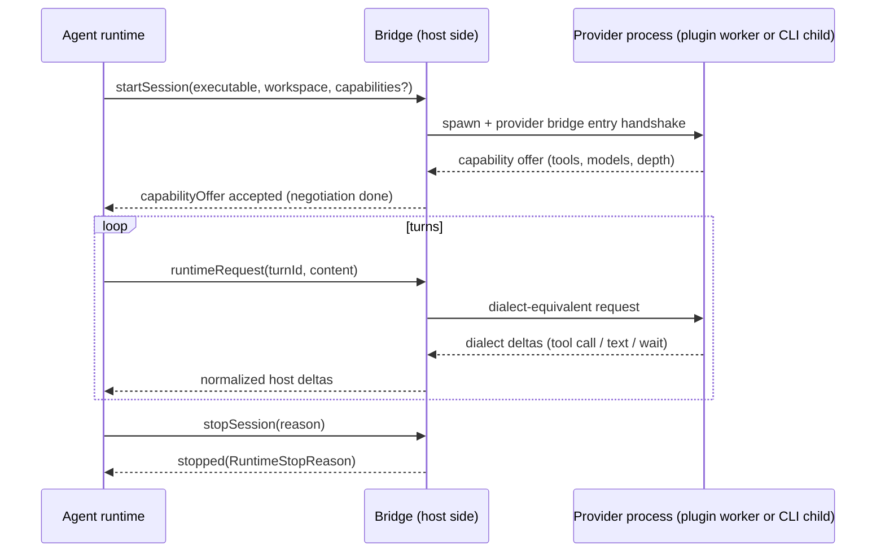

# Deep Exploration — Provider Bridges

**Domain:** dialect normalization — capability negotiation and provider-specific translation
**Path:** `packages/provider-bridge-protocol/`, `packages/provider-bridge-acp/`

---

## Overview

Provider bridges answer the question that makes bb provider-agnostic: **how does a specific provider's raw output become bb's uniform turn/delta grammar?** Each bridge is the adapter between a provider CLI's own dialect (its messages, tool calls, errors, permission prompts) and the `Cmd`-family typeddeltas the rest of bb consumes. The bridge protocol is the shared wire contract (`PROVIDER_BRIDGE_PROTOCOL_VERSION = 2` in `packages/provider-bridge-protocol/src/version.ts`); ACP is one concrete symmetric implementation, and plugin providers speak the same protocol from the plugin worker side.

A bridge runs wherever a provider runs — on the host daemon for CLI providers, in a plugin host worker for programmatic providers — and reports *raw host-local* facts upward. It never decides policy.

### Core File Map

| File | Responsibility |
|------|----------------|
| `packages/provider-bridge-protocol/src/version.ts` | `PROVIDER_BRIDGE_PROTOCOL_VERSION = 2` |
| `packages/provider-bridge-protocol/src/types.ts` | Bridge session, capability, delta, turn types |
| `packages/provider-bridge-protocol/src/bridge-kit/provider-bridge-entry.ts` | How a provider CLI process exposes its bridge entry |
| `packages/provider-bridge-acp/src/bridge/bridge.ts` | ACP dialect adapter (host side) |
| `packages/provider-bridge-claude/src/...` | Claude Code / Codex dialect adapter (host side) |

## Key Design Decisions

- **One uniform protocol, two concrete adapters.** The host protocol is a stable, versioned contract; `provider-bridge-acp` and the CLI adapters are interchangeable implementations of it.
- **Capability negotiation at session start.** The bridge doesn't assume tools or model support; it negotiates a capability set with the concrete provider and tells agent runtime what it can do.
- **Deltas are normalized, errors are typed.** A provider's "I can't do that" becomes a typed rollback/delta, so the server can inspect *why* — not a string to regex-match.

## Core Components

| Token | Location | Role |
|-------|----------|------|
| Bridge host entry | `bridge-kit/provider-bridge-entry.ts` | Process-owned bridge bootstrap |
| `SESSION` / capability handshake | `src/types.ts` | Negotiated capabilities + session identity |
| ACP bridge | `provider-bridge-acp/src/bridge/bridge.ts` | Converts ACP wire ↔ host deltas |
| CLI bridges | `provider-bridge-claude/src/...` | Claude Code / Codex dialect ↔ host deltas |

## Bridge Session Lifecycle

## Protocol Sketch

- Requests/results carry a `sessionId` (and `turnId` where a turn is active), so the runtime can correlate a delta to the exact turn it belongs to.
- `PROVIDER_BRIDGE_PROTOCOL_VERSION = 2` gates feature negotiation between the runtime and the bridge, mirroring the daemon's own version discipline.
- ACP-variant semantics (session/turn/tool) map one-to-one onto the host protocol, which is why `provider-acp` is the reference plugin-provider implementation.

## Interactions

- **Upstream:** `packages/agent-runtime` consumes host deltas.
- **Downstream:** provider processes — CLI children on the daemon, plugin workers in-process.
- **Plugin registration:** a plugin provider implements the *client/agent* end of this protocol, so `defineProvider` plugins share the same grammar as built-ins.

## Performance

- Streaming deltas arrive as a framed NDJSON/JSON-RPC stream; the runtime forwards them without buffering.
- Capability negotiation happens once per session, not per turn.

## Implementation Highlights

- **Versioned wire even inside the adapter layer** — a bridge upgrade never silently breaks an older runtime; it negotiates or refuses.
- **Dialect work stays in one folder** — `provider-bridge-acp/src/bridge/bridge.ts` is a crisp adapter with no policy, matching ADR-2 (provider process over vendor API) and ADR-5.
- **Typed stop reasons** let the server distinguish "user cancelled" from "provider crashed" — a distinction that drives correct thread states (see `thread-services.md`).

Sibling docs: `agent-runtime.md`, `host-daemon.md`, `provider-services.md`, `bundled-plugins.md`.