# Deep Exploration — Provider Services

**Domain:** provider registry, model catalogs, execution-plan provider choice
**Path:** `apps/server/src/services/providers/`

---

## Overview

bb never assumes an LLM vendor. *Providers* are the connectable agent CLIs — Codex, Claude Code, Pi, ACP — plus any plugin-registered provider. Provider services maintain the registry of what providers exist, refresh their model catalogs and capabilities, and answer the scheduler's question: *which provider (and model) should this thread run on?*

The exotic insight: provider *capabilities* are described by the executor, not assumed by the caller (see `2.Architecture.md` §5.2). The server discovers provider CLIs, gathers their declared model catalogs, and resolves threads to the best-executing provider the user has actually authenticated.

### Core File Map

| File | Responsibility |
|------|----------------|
| `provider-registry.ts` | Registry of known provider CLIs (built-in + plugin-added) |
| `provider-clis.ts` | Mapping provider name → executable/CLI metadata |
| `provider-usage.ts` | Usage/state records per provider invocation |
| `execution-plan.ts` (threads) | Resolves provider + model + env into an execution plan |
| `provider-retry` (plugin) | Bundled plugin adding provider retry policy |

## Key Design Decisions

- **Provider = executable, not API.** Each provider is a CLI bb can spawn (or a programmatic plugin provider). No hard-coded vendor HTTP client lives server-side; dialect translation lives in bridge packages (`packages/provider-bridge-*`).
- **Capabilities are discovered, not hardcoded.** Model catalogs and toolgrammars come from the provider/bridge handshake at runtime, so a new provider version changes behavior without a server redeploy.
- **Plugin providers are a first-class seam.** `defineProvider` in the Plugin SDK registers a provider exactly like a built-in one (`plugins/provider-*/`).

## Core Components (Functions/Types)

| Token | Location | Role |
|-------|----------|------|
| `ProviderRegistryService` | `provider-registry.ts` | Lookup/enumerate providers + capabilities |
| Provider CLI table | `provider-clis.ts` | name → executable metadata |
| `resolveExistingThreadExecutionPlan` | `../../threads/execution-plan.ts` | Choose provider/model for a running thread |
| `ProviderCapability` / model catalog types | `provider-registry.ts` | Negotiated feature bit + model list |

## Provider → Thread Flow

```mermaid
flowchart LR
    A["ProviderRegistryService<br/>provider-registry.ts"] --> B["discover CLIs<br/>provider-clis.ts"]
    B --> C["bridge capability handshake<br/>packages/provider-bridge-*"]
    C --> D["model catalog + tools"]
    D --> E["resolveExistingThreadExecutionPlan<br/>threads/execution-plan.ts"]
    E --> F["daemon spawns provider process"]
    F --> G["thread runs (WF-1)"]
    P["plugin defineProvider"] --> A
```

## Interactions

- **Upstream:** thread dispatch resolves execution plans through this module; environments signal which provider an environment expects.
- **Downstream:** tells the daemon *which* CLI to spawn; the daemon never decides.
- **Bundled providers:** `provider-codex`, `provider-claude-code`, `provider-pi`, `provider-acp` in `plugins/` are the reference integrations; `provider-usage` / `provider-retry` add policy.

## Performance

- Registry is a typed in-memory structure re-derived from config + plugin activation; catalogs are cached with refresh sweeps so thread dispatch does not block on network.
- Execution-plan resolution is a pure DB + registry read (no daemon round-trip).

## Implementation Highlights

- **Capability over assumption.** A thread is scheduled only on providers whose negotiated capabilities cover the thread's tool set; the refusal reason is explicit (starred in the timeline) rather than a mystery modal.
- **Retry policy is pluggable, not baked in.** `provider-retry` is a plugin, demonstrating the platform seam: provider behavior is extension, not server core.

Sibling docs: `agent-runtime.md` (bridge/turn execution), `provider-bridges.md` (dialect), `bundled-plugins.md` (reference providers), `host-daemon.md`.