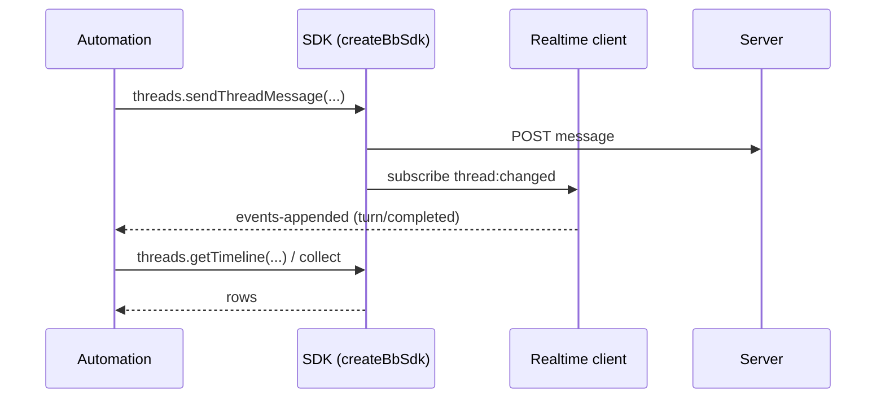

# Deep Exploration — SDK

**Domain:** the programmatic client library — all server capabilities without the UI
**Path:** `packages/sdk/`

---

## Overview

The SDK is the programmatic surface of bb: a typed TypeScript client (`createBbSdk`) that mirrors the public API contract and adds a realtime client on top. It is what the CLI and every automation path use to talk to the server. It is contract-typed against `@bb/server-contract`, so adding a route to the server forces at least a compile-time upgrade for SDK consumers — the same drift-proof discipline as the plugin SDK.

### Core File Map

| File | Responsibility |
|------|----------------|
| `src/core.ts` | `createBbSdk` factory + realtime client wiring |
| `src/realtime-client.ts` | WebSocket subscription on top of the same server hub |
| `src/threads.*`, `src/hosts.*`, `src/envs.*`, `src/plugins.*` | Capability areas (<code>BbSdkAreas</code>) |
| `src/types.ts` | Public SDK surface types (deps on server-contract) |

## Key Design Decisions

- **One SDK, two modes.** `createBbSdk(args)` overloads return either a guide-typed bundle or the raw `BbSdkAreas` (per `core.ts:67-69`) — automation can pick the ergonomic or the low-level view.
- **Realtime is bundled, not separate.** `realtime-client.ts` reuses the same `events-appended` hub as the web app, so scripted automation can await thread completion rather than poll.
- **Consumed by the CLI, exposed to users.** `apps/cli` is a thin shell around this SDK; users get the same power with `bb` or inline JS.

## Components

| Component | Location | Notes |
|-----------|----------|-------|
| `createBbSdk` | `src/core.ts:67` | Factory; guide/surface duality |
| `realtime-client` | `src/realtime-client.ts` | WS subscribe/patch (thread, env, host domains) |
| Areas | `src/core.ts` areas | threads, hosts, envs, plugins, projects, settings |
| Types | `src/types.ts` | Re-exported server-contract types |

## Flow — Scripted Thread Run



## Interactions

- **Server contract:**

```
BbSdkAreas -> @bb/server-contract (publicApiRoutes)
```
Any API change surfaces here first at compile time.

- **CLI:** `apps/cli` calls the SDK; headless parity guaranteed.
- **Plugins:** server plugins can also call the SDK (server-slotted code is a client of its own server).

## Performance

- Real type-safety at call sites; no runtime URL string building (routes from contract).
- Realtime client coalesces with the server hub, so long-running automation costs one socket.

## Implementation Highlights

- **Typed Areas are a public API surface** — adding a capability area is a contract change, reviewed like a route change.
- **Realtime-first automation:** awaiting `events-appended` beats polling loops and is battle-tested by `bb connect` and scheduled-send plugin workflows.

Sibling docs: `cli.md`, `server-core.md`, `contracts.md`, `5.Boundaries-Interfaces.md`.