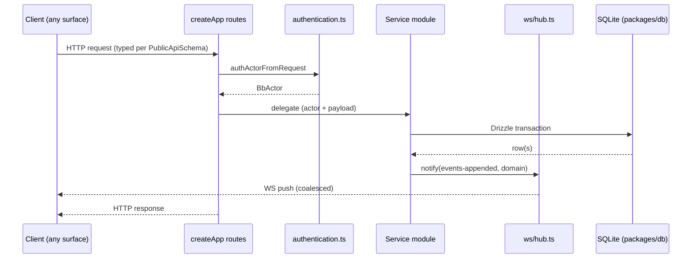

# Deep Exploration — Server Core

**Domain:** server core (HTTP+WS API, product policy, composition root)
**Path:** `apps/server/src/`

---

## Overview

The server is the single composition root of bb. Every surface — web app, mobile app, CLI, SDK, desktop shell, plugins — talks to this one process over a typed HTTP + WebSocket API, and it alone reads and writes the SQLite `bb.db` database. It is intentionally a *policy* server, not an *execution* server: it decides what happens (defaults, provider capabilities, permission ceilings, thread behavior) and delegates all machine-local execution to enrolled host daemons. The daemon returns raw host state; the server turns that state into product behavior.

Three files anchor the whole server: `server.ts` (composition), `start-server.ts` (bootstrap), and `authentication.ts` (actor model).

### Core File Map

| File | Responsibility |
|------|----------------|
| `src/server.ts` | `createApp`: wires zod auth, typed route plugins, session middleware, hubs |
| `src/start-server.ts` | `runServer`: binds the HTTP listener, WS server, periodic sweeps |
| `src/authentication.ts` | Bearer-token auth → `BbActor` (user, machine, daemon, anonymous) |
| `src/routes/` | One file per resource (`threads.ts`, `envs.ts`, `hosts.ts`, `plugins.ts`, …) |
| `src/ws/hub.ts` | `NotificationHub` + WS sessions, subscriptions, RPC request routing |
| `src/services/` | Domain service modules (see sibling module docs) |
| `src/services/periodic-sweeps/` | Crash-recovery + retry rosters |

## Key Design Decisions

- **Single writer to SQLite.** All state changes funnel through Drizzle transactions in `packages/db`. The server never keeps authoritative in-memory copies; the DB is the source of truth and UI is a projection.
- **The server never provisions workspaces.** Workspace creation, provider spawning, and file/git operations are daemon commands (`host-daemon-contract`). But their *scheduling* is server policy (`services/threads`, `services/environments`).
- **Exactly-once intent via queue claims.** `queuedThreadMessages` rows are deleted by the same transaction that dispatches them (compare-and-swap), so a crash cannot double-send a message.
- **Versioned wire contract.** Route schemas live in `@bb/server-contract` and are imported (not duplicated) by `createApp`, so server and client share one zod schema. `HOST_DAEMON_PROTOCOL_VERSION = 215` gates the daemon surface.

## Core Components

| Component | Location | Notes |
|-----------|----------|-------|
| `createApp` | `apps/server/src/server.ts:443` | Assembles typed routes; each route opts into `authActorFromRequest` |
| `runServer` | `apps/server/src/start-server.ts:94` | Binds HTTP + WS, starts sweeps, graceful shutdown |
| `BbActor` | `apps/server/src/authentication.ts` | user / machine / daemon / anonymous identity with `kind` discriminant |
| `NotificationHub` | `apps/server/src/ws/hub.ts:422` | Coalesced `events-appended` fan-out, per-session subscriptions, RPC waiters |
| Auth session | `apps/server/src/authentication.ts` | Bearer + optional trusted machine credential |

## Internal Data Flow

## Data Model

The server owns all tables in `packages/db/src/schema.ts`; the DB overview document enumerates them. The server's own tables are the composition records: `threads`, `projects`, `hosts`, `environments`, `plugins`, `settings`, `authTokens`. Events are the append-only log backing threads (`events` table, `schema.ts:775`).

## Interactions

- **With clients:** all official surfaces share the same contract (`@bb/server-contract`). Custom clients use the SDK (`packages/sdk`).
- **With daemons:** every command is *settled* (request/response with `requestId`), never fire-and-forget; offline hosts produce a clear "daemon offline" rejection.
- **With plugins:** server plugins register RPCs/slots and get a plugin-scoped SQLite DB (`services/plugins/plugin-db.ts:291`); the server never exposes the main DB row store to plugin code.

## Performance

- Coalesced hub pushes: bursty daemon deltas become one `events-appended` per 10 ms bucket.
- Long-poll fallback for sockets that cannot keep WS open — same event stream, single implementation in `hub.ts`.
- O(1)-ish route dispatch; heavy reads (timeline) go through `@bb/thread-view` windows.

## Implementation Highlights

- **Typed routes are the API contract.** Changing `packages/server-contract/src/public-api.ts` fails every client + server typecheck simultaneously — the contract cannot silently drift.
- **Auth is minimal by design.** One bearer token + per-machine credentials; no roles/permissions matrix because policy is expressed by *capability-added* feature bits, not by a user-group system.
- **All long-running intent is sweepable.** If anything spans beyond a request (dispatch, environment provisioning), there is a corresponding `PeriodicSweepJob` to finish or fail it after a crash.

Sibling docs: `thread-services.md`, `environment-services.md`, `host-services.md`, `provider-services.md`, `plugin-system.md`, `host-daemon.md`, `contracts.md`, `config.md`.