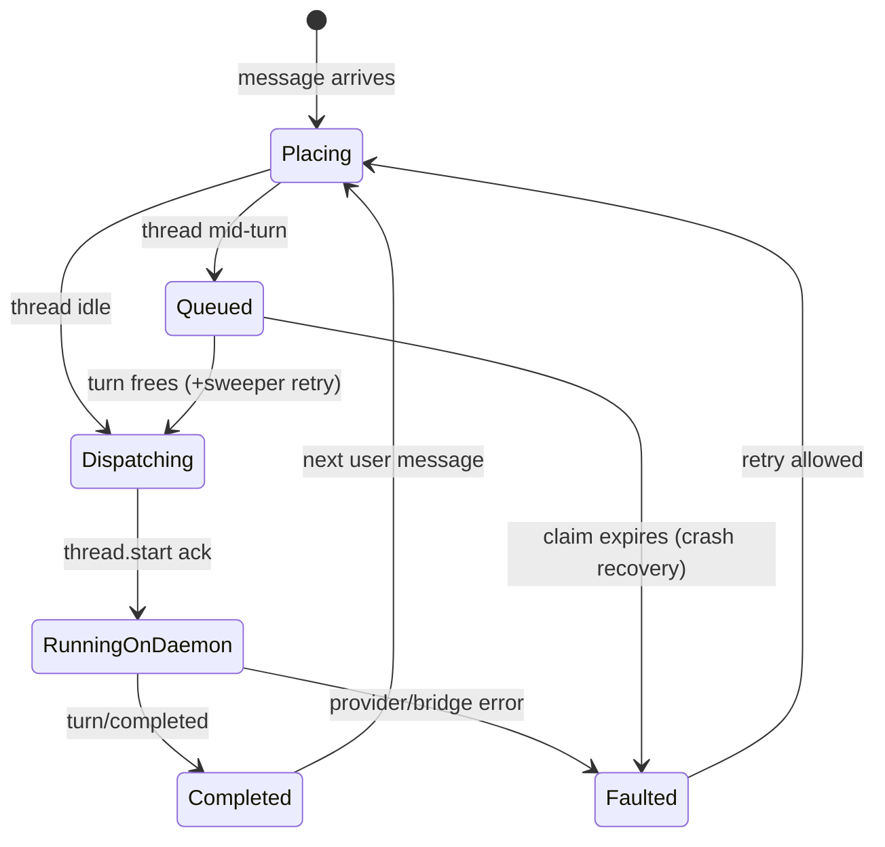
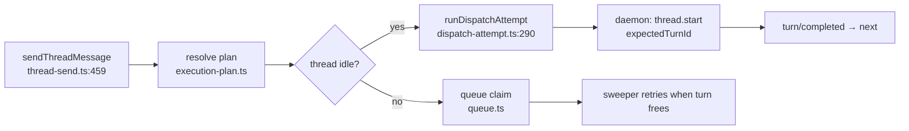

# Deep Exploration — Thread Services

**Domain:** thread lifecycle — send, steer, fork, queue, archive, timeline
**Path:** `apps/server/src/services/threads/`

---

## Overview

Threads are bb's unit of work. A thread is a conversation plus a lifecycle plus an environment: it names a provider, a worktree, and an ordered list of turns (each an agent session). Thread services own everything the server does with a thread: dispatching user messages into running provider processes, queueing messages during a busy turn, steering (stop/retry/fork), and computing the reply-ready timeline that surfaces render.

The engine behind it all is `@bb/thread-view` (a shared projection package); thread services feed it stored events and it returns conversation/work/turn rows.

### Core File Map

| File | Responsibility |
|------|----------------|
| `thread-send.ts` | Entry point `sendThreadMessage` → validate, plan, run or queue |
| `dispatch-attempt.ts` | `runDispatchAttempt`: claim the queue, issue `thread.start`, open the turn |
| `execution-plan.ts` | Resolve provider + environment + worktree + manager lifecycle |
| `timeline.ts` | `buildThreadTimelineWithProfile` → row projection for clients |
| `manager-worker.ts` | Server-side "manager owns turn; worker streams" lifecycle |
| `queue.ts` | `queuedThreadMessages` claim handling (insert/claim/delete) |

## Key Design Decisions

- **Event-sourced**, not mutable chat state. The conversation lives in the `events` table; "send" only appends. Forks and rewinds are cheap interpretations of the log, not migrations of a JSON blob.
- **Exactly-once dispatch.** A queued message is claimed and deleted inside the exact transaction that emits `client/turn/requested`; a crash leaves the claim for the sweeper.
- **Server is the manager, daemon is the worker.** The server owns *whether* work proceeds (dispatch gate, expectedTurnId); the daemon owns *how* the provider streams it.

## Core Components (Functions)

| Function | Location | Role |
|----------|----------|------|
| `sendThreadMessage` | `thread-send.ts:459` | Validate + resolve plan + run-or-queue |
| `runDispatchAttempt` | `dispatch-attempt.ts:290` | Claim, gate, dispatch `thread.start`, supervise turn |
| `resolveExistingThreadExecutionPlan` | `execution-plan.ts` | Provider model/env/worktree for a thread |
| `buildThreadTimelineWithProfile` | `timeline.ts:1524` | Project stored events into reply-ready rows |
| `sendSteerableMessage` / continue | `thread-send.ts` sibling | In-turn steering (retry, fork, stop-and-continue) |
| Queue claim atomics | `queue.ts` | CAS semantics for `queuedThreadMessages` |

## Turn Lifecycle

## Data Flow — Send

## Data Model

- `threads` — headless row: id, project, installed-environment-name, lifecycle.
- `events` — append-only `ThreadEvent` log (zod-typed kinds like `client/turn/requested`, `turn/completed`, `thread-start-tw/kickoff`).
- `queuedThreadMessages` — claim rows holding a message until dispatch (or crash-recovery expiry).

The schema tables are detailed in `6.Database-Overview.md`; `events` is at `packages/db/src/schema.ts:775`.

## Interactions

- **Upstream:** routes (`apps/server/src/routes/threads.ts`) call `sendThreadMessage`/steer/archive.
- **Downstream:** dispatch issues daemon commands through `services/hosts`; environment readiness via `services/environments`; provider choice via `services/providers`.
- **Realtime:** after each batch of event appends, `NotificationHub` fans out `events-appended` to subscribed sessions.
- **Bundled plugins** also send messages (Scheduled Send, Tasks, automations) through this same service, not around it.

## Performance

- Timeline reads are O(window) — `@bb/thread-view` iterates only the requested `sequenceIndex` window, never the whole log (`packages/thread-view/src/build-thread-timeline.ts:1155`).
- Queueing is a single-row upsert; dispatch contention is serialized by the single-writer DB, not by locks.
- Steer commands carry `expectedTurnId`, so a stale client cannot clobber a newer turn.

## Implementation Highlights

- **Queued-message CAS** (`queue.ts`) is the financial-ledger discipline: read-check-write in one transaction, so a crash between "wanted to dispatch" and "did dispatch" cannot double-send.
- **`expectedTurnId` threading** (from domain types) makes mid-turn steering safe even when the UI and the daemon race — the daemon settles the gate, echoing the new turn id.
- **Sweepable intents:** any dispatch that spans a restart is covered by a periodic job, so a server reboot mid-turn converges to a faulted-but-retryable thread rather than a stuck one.

Sibling docs: `server-core.md` (route/hub wiring), `thread-view.md` (projection), `agent-runtime.md` (daemon-side turn state machine), `host-daemon.md`.