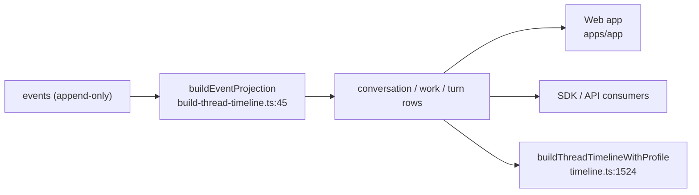

# Deep Exploration — Thread View

**Domain:** the event-to-timeline projection — shared by server and client
**Path:** `packages/thread-view/`

---

## Overview

Thread view is the *read path* engine: it turns the append-only `events` log of a thread into the conversation/work/turn rows that every UI renders and SDK/automation consumes. It lives in its own package because both the server (initial timeline page) and the browser (scroll-back, realtime patches) must produce *identical* projections — one implementation, no drift. It is deterministic, windowed, and unit-tested (fork/retry/rewind cases).

### Core File Map

| File | Responsibility |
|------|----------------|
| `src/build-thread-timeline.ts` | `buildEventProjection` (line 45) + `buildThreadTimelineFromEvents` (line 1155) |
| `src/types.ts` | Projected row types (conversationRow / workRow / turnRow) |
| `test/build-thread-timeline.test.ts` | Projection unit tests (fork/retry/rewind) |

## Key Design Decisions

- **One projection, two consumers.** The server renders initial pages through `buildThreadTimelineWithProfile` (`apps/server/src/services/threads/timeline.ts:1524`); the browser renders scroll-back through the identical `@bb/thread-view` call. Identical output = identical UX, no heisenbugs.
- **Windowed, not materialized.** The projection walks only the requested `sequenceIndex` window, so large threads render in O(rows-viewed) and never force a full-log replay.
- **Typed rows over rich UI.** Conversation, work (tool calls), and turn rows are plain typed shapes — the web app maps them to visual cards; automation consumes them as data.

## Projection Model

## Core Components

| Function | Location | Role |
|----------|----------|------|
| `buildEventProjection` | `build-thread-timeline.ts:45` | Classify events into typed cell types |
| `buildThreadTimelineFromEvents` | `build-thread-timeline.ts:1155` | Windowed projection → row list |
| Row types | `src/types.ts` | conversation/work/turn row discriminants |

## Interactions

- **Server timeline service:** `apps/server/src/services/threads/timeline.ts` wraps it (`buildThreadTimelineWithProfile` at line 1524).
- **Client:** `apps/app` timeline rendering + realtime patches (see `web-app-ui.md`, `client-state-realtime.md`).
- **Tests:** fork/retry/rewrite scenarios are the core correctness cases because they are the expensive part of event sourcing to get right.

## Performance

- Deterministic, pure, cacheable: identical input events → identical rows, trivially memoizable.
- Windowed traversal keeps a 10,000-event thread as fast as a 100-event thread for a visible screenful.

## Implementation Highlights

- **The projection is the contract.** If someone adds an event kind, the `build-thread-timeline.test.ts` suite and the server/client compile both flag it — the event grammar cannot silently diverge from what renders.
- **`expectedTurnId` feedback survives projection:** retry/fork/rewind all present as distinct row classes, so a rewritten answer never looks like an ordinary duplicate.

Sibling docs: `thread-services.md`, `web-app-ui.md`, `client-state-realtime.md`, `6.Database-Overview.md`.