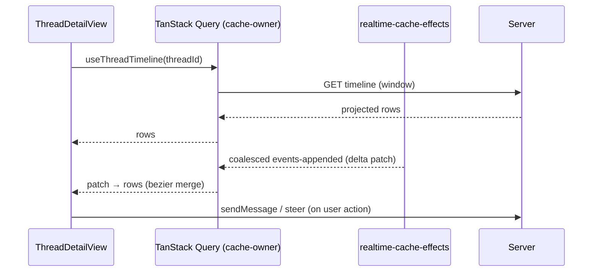

# Deep Exploration — Web App UI (Client)

**Domain:** the React web application — thread workspace, timeline rendering, settings
**Path:** `apps/app/`

---

## Overview

The web app is the full-thickness client: every server capability has a UI here, and every plugin's app slots render into it. It is architecturally a *projection* of server state — a React 19 + Vite SPA whose authoritative state lives in the server's SQLite; the client owns only its TanStack Query cache and realtime patch stream. The thread workspace (`ThreadDetailView`, timeline rows) is the marquee feature, but the app also covers new-thread flow, environment management, hosts, plugins/marketplace, settings, and the message/typeahead composer.

### Core File Map

| File | Responsibility |
|------|----------------|
| `apps/app/src/App.tsx` | Router + provider wiring (installation gates, session) |
| `apps/app/src/views/thread/ThreadDetailView.tsx` | Thread workspace composition |
| `apps/app/src/views/thread/ThreadTimelineRows.tsx` / renderer | Timeline rendering of projected rows |
| `apps/app/src/views/new-thread/NewThreadView.tsx` | New-thread flow (env picker, provider picker) |
| `apps/app/src/hooks/realtime-cache-effects.ts` | Realtime invalidation → query cache patching |
| `apps/app/src/hooks/query-keys.ts` + `apps/app/src/hooks/cache-owners.ts` | Cache ownership model |
| `apps/app/src/components/ui/theme.css` + tokens | Theme token system (no arbitrary `text-[Npx]`) |

## Key Design Decisions

- **Cache-owners over global state.** Each query is owned by a single `cache-owner`; mutations go through the owner, invalidation only through `realtime-cache-effects`. This is what makes realtime safe: exactly one writer per cache slice.
- **Timeline is a projection.** The client asks for an event window (`thread-view`), gets conversation/work/turn rows, and renders them. Retry/rewrite/fork are just new projections over the same event log.
- **Theme is tokenized.** Colors derive from `--canvas`/`--ink` tokens; achromatic `oklch(L 0 0)` literals are forbidden (see `theme.css` and `theme.test.ts`). Layout uses the shared persistent responsive drawer for slide-out menus/pickers (matching AGENTS.md UI rules).

## Core Components

| Component | Location | Notes |
|-----------|----------|-------|
| `ThreadDetailView` | `apps/app/src/views/thread/ThreadDetailView.tsx` | Sends messages, steers, forks, archives |
| `ThreadTimelineRows` | `apps/app/src/views/thread/ThreadTimelineRows.tsx` | Rows for conversation/work/turn |
| Composer / send | `apps/app/src/views/thread/send*` | Typeahead + submit → `sendThreadMessage` server RPC |
| `realtime-cache-effects` | `apps/app/src/hooks/realtime-cache-effects.ts` | Connect WS, patch caches, reconnect semantics |
| Route shell | `apps/app/src/App.tsx:420` | TanStack Router — session, install gates, layout |

## Data Flow — Render a Thread

## Interactions

- **Server:** every view is thin over the server contract (`@bb/server-contract`); no direct DB access from the client.
- **Plugins:** `packages/plugin-app-rides.ts` merges plugin slot renderers into `App.tsx` surfaces (Marketplace, Memory, Monitor, Side Chat).
- **Realtime:** `realtime-cache-effects` subscribes per-query-key, refetches errored queries on reconnect, and disposes trailing active refetches (line 17, 486, 574).

## Performance

- Coalesced WS pushes mean a burst of provider deltas becomes one React state transition.
- Timeline windows (`thread-view`) keep scroll-back O(rows-viewed); big threads stay snappy.
- Suspense/lazy views keep first paint small; the persistent drawer defers heavy content (two animation frames + timeout fallback per AGENTS.md UI rules).

## Implementation Highlights

- **One writer per cache slice.** `apps/app/src/hooks/cache-owners.ts` enforces that only the owning hook mutates a query — realtime patches are the *only* external writer, and they only append/invalidate.
- **Deterministic timeline render.** The renderer consumes `@bb/thread-view` rows; retry and fork produce visibly distinct rows without bespoke UI state.
- **Session gating in App.tsx** keeps anonymous users out of reservation-locked views and routes install flows from the same shell.

Sibling docs: `server-core.md`, `thread-services.md`, `thread-view.md`, `config.md`, and the CSS/theme rules in `apps/app/src/components/ui/theme.css`.