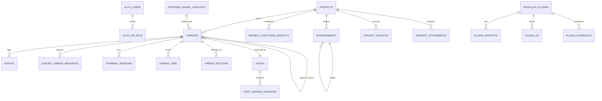

# Database Overview

bb persists to a single local SQLite database via **Drizzle ORM** (`packages/db`) — the server is the sole writer and every surface reads through it. The full history is 128 committed SQL migrations (`packages/db/drizzle/0000_baseline.sql` … `0127_*.sql`); the current schema has **43 tables** defined in `packages/db/src/schema.ts`. This document covers the core tables, the crown-jewel `events` log, and the handful of supporting tables — all annotated with schema-file line numbers for navigation.

---

## 1. Logical Overview

## 2. Table Inventory (schema.ts line → purpose)

| Table | Line | Purpose |
|-------|------|---------|
| `authUsers` | 42 | User rows (identity). |
| `authApiKeys` | 56 | API keys for user/machine access. |
| `hosts` | 93 | Enrolled host daemons (machineUrl, label, security decisions). |
| `projects` | 147 | Top-level project containers. |
| `projectExecutionDefaults` | 169 | Per-project default provider/env/worktree. |
| `systemExperiments` | 187 | Feature-flag experiments. |
| `environmentVariables` | 193 | Workspace env vars (ecrypted where sensitive). |
| `appSettings` / `appSettingsValues` | 229 / 216 | Server-owned settings + per-instance values. |
| `uiPreferences` | 222 | UI state that survives sessions. |
| `installedPlugins` | 275 | Plugin registry rows (name, generation). |
| `pluginArtifacts` | 329 | Bundled artifact digests (provenance). |
| `pluginMarketplaces` (+icons) | 351 / 370 | Marketplace catalog + icons. |
| `pluginStateSnapshots` | 385 | Rollback generations. |
| `pluginKv` | 422 | Namespaced kv store for plugins. |
| `pluginSettings` | 433 | Plugin settings. |
| `pluginSchedules` | 444 | Cron schedules plugins register. |
| `appTheme` | 459 | Theme token overrides. |
| `projectSources` | 469 | Git remotes per project. |
| `environments` | 504 | Workspace descriptors + provisioning state. |
| `threads` | 572 | **The work unit** — see §3. |
| `threadImageMetadata` | 668 | Image attachments metadata. |
| `threadPluginMetadata` | 682 | Plugin-owned thread metadata. |
| `threadTabs` / `threadSections` | 694 / 703 | UI organization of thread content. |
| `threadSearchSegments` | 714 | Search projection segment store. |
| `threadConversationOutlines` | 741 | Outline cache for conversation (used by UI + LLM context). |
| `threadDynamicContextFileStates` | 752 | Dynamic context file state. |
| `events` | 775 | **The event log — the source of truth** — see §4. |
| `retainedEventOutputs` | 861 | Retained tool outputs for pruning retention. |
| `threadPruningCursors` | 879 | Pruning position markers. |
| `maintenanceScanCursors` | 914 | Maintenance scan markers. |
| `promptHistoryEntries` | 936 | Recent prompts/actions (recall in context). |
| `queuedThreadMessages` | 973 | **Queued sends with CAS claims** — see §5. |
| `hostDaemonSessions` | 1082 | WebSocket sessions per host daemon. |
| `providerModelCatalogs` | 1121 | Discovered model catalogs. |
| `terminalSessions` | 1141 | Interactive terminal sessions. |
| `pendingInteractions` | 1184 | Interactive permission/tool waits. |
| `environmentHookOperations` | 1237 | Environment lifecycle hooks. |
| `projectAttachments` / `projectAttachmentThreads` / `projectAttachmentBackfills` | 1251 / 1282 / 1298 | File-sync attachments + backfill state. |

## 3. `threads` — The Work Unit

Defined at `schema.ts:572`. Key columns:

| Column | Meaning |
|--------|---------|
| `projectId` | owning project (FK, cascade delete) |
| `environmentId` | workspace env (FK, set-null on delete) |
| `providerId`, `modelOverride`, `reasoningLevelOverride` | execution plan |
| `accountKey` / `accountResolved` | provider account used |
| `status` | lifecycle (`starting`, `running`, `archived`, …) |
| `parentThreadId` / `sourceThreadId` / `lifecycleOwnerThreadId` | threading (fork/parent, source, manager-owner) |
| `originKind` / `originPluginId` | how/from where created |
| `visibility`, `pinnedAt`, `archivedAt`, `deletedAt` | lifecycle flags |
| `latestAttentionAt`, `createdAt`, `updatedAt` | ordering stamps |

Indexes are deliberate and query-shaped (project+status, pin-sort, parent/source, origin-plugin-archived, environment+archived+deleted) — they exist to serve the timeline and listing queries without scanning.

## 4. `events` — The Append-Only Event Log

Defined at `schema.ts:775`. This is where the "event-sourced thread" philosophy is realized: every user message, turn event, tool call, and provider delta is a typed row in a strictly sequential log.

| Column | Meaning |
|--------|---------|
| `threadId` | owning thread (FK, cascade) |
| `environmentId` | env scope (FK, set-null) |
| `scopeKind` | conversation / work / turn scope |
| `turnId` | the turn this event belongs to |
| `providerThreadId` | provider's own thread id |
| `sequence` | **monotonic per thread** (unique w/ threadId) |
| `type` | `ThreadEventType` — e.g. `client/turn/requested`, `turn/completed`, `thread-start-tw/kickoff` |
| `itemId`, `itemKind`, `parentToolCallId` | item/relationship keys for tool calls & delegations |
| `data` | the JSON payload of the event |

Why it matters:

- **Read path**: `@bb/thread-view` projects a *window* of these rows into the timeline (see `thread-view.md`); the projection is deterministic and unit-tested.
- **Fork/rewind**: because history is rows, not mutable chat state, a fork or retry is a new interpretation of the same log — no migration needed.
- **Retention**: `retainedEventOutputs` keeps only the tool outputs the pruning policy wants to survive; `threadPruningCursors` track how far pruning has traveled.
- **Consistency**: the `(threadId, sequence)` unique index is the sequencing gate — a dispatch that guesses the next sequence must first claim the *current* one in the same transaction that reserves the row.

## 5. `queuedThreadMessages` — Exactly-Once Claims

Defined at `schema.ts:973`. This table is the server's guarantee of **at-most-once sends under failure**:

- A message that arrives while the thread is mid-turn is *upserted* here as a pending claim.
- The transaction that actually dispatches it does a **compare-and-swap claim** and deletes the row atomically with writing the `client/turn/requested` event. A crash after "queued" but before "dispatched" leaves the row for the periodic sweeper, which retries — never double-sends.

This is the same discipline as a payment ledger, applied to chat: no event is ever written twice because the claim is consumed by exactly one dispatch.

## 6. Cross-Database: Plugin DBs and Connect DB

- **Per-plugin databases** — each plugin gets its own SQLite database (namespaced, applied by `apps/server/src/services/plugins/plugin-db.ts:291`). Plugin DDL can never collide with core tables; this is isolation-by-file.
- **`packages/connect-db`** — the *cloud-side* SQLite (Cloudflare Workers): `user`, `session`, `account`, `verification`, `profile`, `server`, `connectCode`, `machine`, `labelClaim`, `auditLog`. It holds only reachability/credential/session rows (see `cloud-connect.md`) — never product state, which stays in the local `bb.db`.

## 7. Migration Discipline

| Rule | Why |
|------|-----|
| Drizzle schema is the source; migrations are generated and committed as SQL | The committed SQL (wa `drizzle/`) is the release history — 128 steps you can diff and bisect |
| Never hand-edit snapshot JSON | Drift between schema and migrations is the classic silent-breaker |
| Tests use `createConnection(":memory:")` + `migrate(db)` | The real schema runs in every test; no mocked data layer |
| Add indexes only when a query requires it (AGENTS.md) | Each index here earns its place by serving a real listing/timeline query |

## 8. Backup and Operational Notes

- Backing up bb = copying `~/.bb/bb.db` (single-file consistency thanks to SQLite).
- The DB is *deliberately* not a multi-tenant store: one user, one machine-context, one writer. Multi-user/multi-cloud is delegated to the connect cloud's own DB (above), which is the boundary where that behavior belongs.
- Model catalogs (`providerModelCatalogs`) are cached reads that let thread scheduling avoid network; they are refreshed by sweeps, not on the hot path.